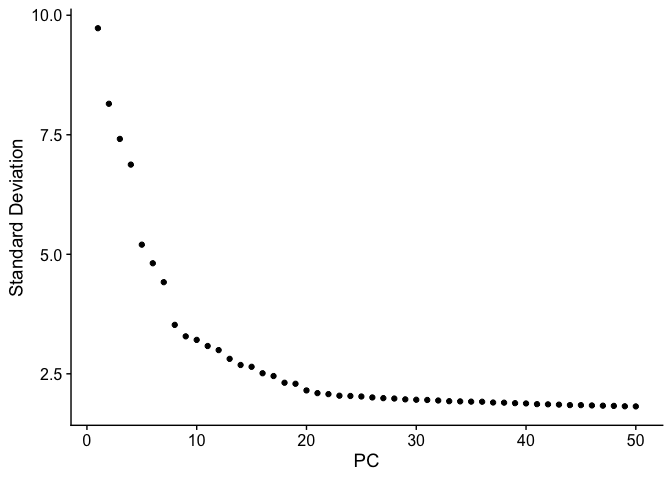
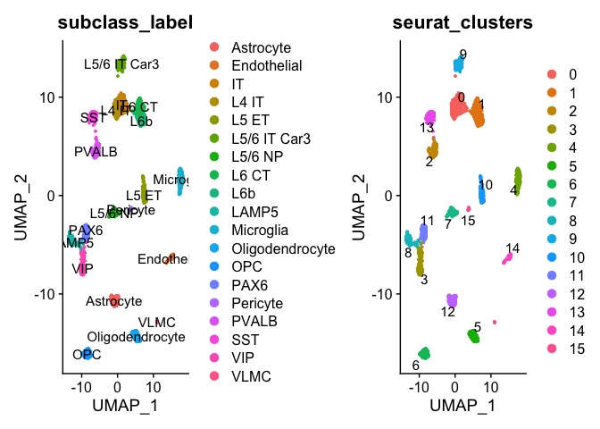
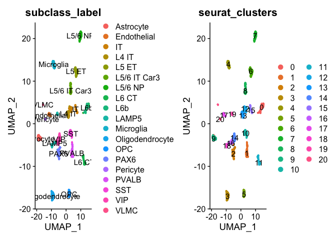

KCNI Summer Academy 2023: Day 1
================
Mel Davie
10/07/2023

# Schedule

Day 1: Intro to single-cell RNAseq analysis, R, and Seurat

Day 2: Intro to differential expression, cell type identification &
visualizations

Day 3: Dataset integration & automated cell type annotation

Day 4: Case-control differential expression with pseudobulks

Day 5: Spatial biology talks @ SickKids & final presentation!

# Datasets

<https://drive.google.com/drive/folders/1VOGGuPjDT49vz95mk4huWOIX9s9-FIQ8?usp=sharing>

# Resources

## Basic R:

R for Data Science <https://r4ds.hadley.nz/>

## Seurat:

Intro tutorial:
<https://satijalab.org/seurat/articles/pbmc3k_tutorial.html>

Differential expression testing:
<https://satijalab.org/seurat/articles/de_vignette.html>

Data visualization:
<https://satijalab.org/seurat/articles/visualization_vignette.html>

Dataset integration & related analyses:
<https://satijalab.org/seurat/articles/integration_introduction.html>

Cell type annotation:
<https://satijalab.org/seurat/articles/integration_mapping.html>

## Case-control differential expression with pseudobulks:

<https://hbctraining.github.io/scRNA-seq/lessons/pseudobulk_DESeq2_scrnaseq.html>

# Intro to single-cell RNAseq analysis, R, and Seurat

## Setup

### Set working directory

Alternatively, you can run setwd(“your_path”) from the console, or
navigate to your directory in the Files tab and select “Set As Working
Directory” from the More dropdown.

``` r
knitr::opts_knit$set(root.dir = "~/Downloads/KCNISS_2023/")
```

### Load packages

These are the first two packages we need—more will be added as we go
along

``` r
#install.packages('tidyverse')
library(tidyverse)
```

    ## ── Attaching core tidyverse packages ──────────────────────── tidyverse 2.0.0 ──
    ## ✔ dplyr     1.1.2     ✔ readr     2.1.4
    ## ✔ forcats   1.0.0     ✔ stringr   1.5.0
    ## ✔ ggplot2   3.4.2     ✔ tibble    3.2.1
    ## ✔ lubridate 1.9.2     ✔ tidyr     1.3.0
    ## ✔ purrr     1.0.1     
    ## ── Conflicts ────────────────────────────────────────── tidyverse_conflicts() ──
    ## ✖ dplyr::filter() masks stats::filter()
    ## ✖ dplyr::lag()    masks stats::lag()
    ## ℹ Use the conflicted package (<http://conflicted.r-lib.org/>) to force all conflicts to become errors

``` r
#install.packages('Seurat')
library(Seurat)
```

    ## The legacy packages maptools, rgdal, and rgeos, underpinning the sp package,
    ## which was just loaded, will retire in October 2023.
    ## Please refer to R-spatial evolution reports for details, especially
    ## https://r-spatial.org/r/2023/05/15/evolution4.html.
    ## It may be desirable to make the sf package available;
    ## package maintainers should consider adding sf to Suggests:.
    ## The sp package is now running under evolution status 2
    ##      (status 2 uses the sf package in place of rgdal)
    ## Attaching SeuratObject

### Load data

Let’s start by loading in the metadata and gene counts for the human
Smart-seq dataset. Note that loading the counts matrix might take a
couple minutes to run.

``` r
# metadata
meta_smart <- read.csv("AIBS_smart_meta_mini.csv", row.names = 1) 
#row.names(meta_smart) should contain same values as row.names(counts_smart)

# counts matrix
counts_smart <- read.csv("AIBS_smart_counts_mini.csv", row.names = 1)
```

## Intro to tidyverse

magrittr: pipe *%\>%*

dplyr: - mutate - filter - select - group_by - summarize - pull

**And later, we can look at…**

dplyr: - bind_rows, left_join, etc.

tidyr: - pivot_longer/pivot_wider

ggplot2: - plot types (e.g. histogram, boxplot, bar, smooth, point,
violin) - themes and aesthetics

### Pipe %\>%

These three operations are equivalent:

``` r
# how many columns are in our metadata?
length(meta_smart) 
```

    ## [1] 16

``` r
# instead of directly listing our metadata object within the function call, "pipe" 
# it in to the desired location, marked by "."
meta_smart %>%  
  length(.)
```

    ## [1] 16

``` r
# when piping into a function, the target location is assumed to be the first 
# parameter, so we don't need to specify "." unless we want it somewhere else 
# (or in multiple locations)
meta_smart %>% 
  length
```

    ## [1] 16

### dplyr

#### mutate()

Let’s say we want to add a column to our metadata that stores both the
subclass label and the cortical layer information for each cell:

#### filter()

Okay, now we’re only interested in keeping cells annotated as VIP
neurons:

#### select()

We don’t need all of these columns—let’s only keep the ones we’ve just
used, plus the sample name. Also, columns will appear in the order you
list them, so this is an easy opportunity to reorder.

Note: if you’re getting an error running the select function, you likely
have another package loaded that’s masking the function we need. To use
a function from a specific package, you can preface it with the name of
the package followed by a double colon, as is done below.

#### group_by()

Let’s say we want to apply a function to info from our metadata in a
group-wise manner. For example, we want to count up the number of cells
that we have within each cortical layer.

This is where the pipe starts to come in handy, because without it, we’d
have to store an intermediate output that we don’t want.

``` r
meta_smart %>% 
  group_by(cortical_layer_label) %>% 
  tally # tallies the number of items in each unique group 
```

    ## # A tibble: 13 × 2
    ##    cortical_layer_label     n
    ##    <chr>                <int>
    ##  1 L1                     267
    ##  2 L2                     320
    ##  3 L3                     338
    ##  4 L4                     225
    ##  5 L4ab                    40
    ##  6 L4c                     84
    ##  7 L5                     467
    ##  8 L5a                     34
    ##  9 L5b                    101
    ## 10 L6                     397
    ## 11 L6a                    138
    ## 12 L6b                     82
    ## 13 WM                      20

``` r
#(without specifying grouping, all the rows are assumed to be in one group)
```

#### summarize()

This function works similarly to mutate in that it will create new
columns that you define, but instead of creating a new value for each
row like mutate, it will collapse to one row containing a value that
summarizes all rows or, when provided with a grouping structure, a set
of rows each containing a value that summarizes all rows within a group.

Let’s put this all together to ask a really specific (albeit odd)
question with our metadata: What region / cortical layer combo is the
most common location for our VIP neurons, stratified by donor sex?

``` r
meta_smart %>% 
  filter(subclass_label == "VIP") %>% 
  select(region_label, cortical_layer_label, donor_sex_label) %>% 
  mutate(region_layer_label = paste(region_label, cortical_layer_label, 
                                    sep = " ")) %>% 
  group_by(donor_sex_label, region_layer_label) %>% 
  tally %>% 
  summarize(region_summary = region_layer_label[which.max(n)])
```

    ## # A tibble: 2 × 2
    ##   donor_sex_label region_summary
    ##   <chr>           <chr>         
    ## 1 F               MTG L2        
    ## 2 M               MTG L1

#### pull

Finally, if there’s a column in a dataframe that you’d like to grab and
use somewhere else, you can extract those values using this function.

For example, you might just want to grab the sample names to use for
filtering other dataframes:

## Intro to the Seurat object

We’ll start off with the human SMART-seq data we loaded earlier.

For more information about this dataset, check here:
<https://portal.brain-map.org/atlases-and-data/rnaseq/human-multiple-cortical-areas-smart-seq>

``` r
Seu_smart <- CreateSeuratObject(counts = t(counts_smart), 
                                meta.data = meta_smart) #t(counts_smart) transposes 
# so that we have rows as genes and columns as samples as they should be for Seurat

# can choose to remove large matrices now that we have Seurat obj:
#rm(counts_smart, meta_smart) 
```

*S3 vs. S4 objects* - Seurat obj is S4, S4s much more defined, must
contain and can only contain certain things which are formally named -
informal dataframes and lists like metadata stored in S3

We can move through data structure with *\$* or \*@\* (can use tab
completion to know which is appropriate)

### Pre-processing

We’re first going to go through each step one-by-one to understand what
is happening and what we might want to change for our dataset, and then
we’ll check out an all-in-one method afterwards.

Note: normally, it is bad practice to overwrite an object when making
changes to it. Here, we are simply adding results in data section of the
Seurat object, not overwriting any data, because we are using Seurat
functions.

#### Normalization

*NormalizeData()* normalizes the gene expression values in the Seurat
object Seu_smart using the “LogNormalize” method. It applies a
logarithmic transformation to the data and scales the expression values
by a factor of 1,000,000 (scale.factor) to make them more comparable
across cells.

Normalization is necessary to remove technical variations and biases in
the data that could arise from differences in sequencing depth or cell
size. CPM or counts per million is the most common scale factor used in
this context to achieve a reasonable range of expression values for
subsequent analyses.

#### Find variable features

*FindVariableFeatures()* identifies highly variable features (genes) in
the dataset using the variance-stabilizing transformation (VST) method.
The nfeatures parameter specifies the number of top variable features to
select (in this case, 2000).

Identifying variable features is important for downstream analyses as it
helps focus on genes that show meaningful variation across cells and can
be informative for distinguishing different cell types or states. The
choice of nfeatures depends on the dataset and the desired balance
between capturing a sufficient number of informative genes and avoiding
noisy or uninformative genes.

#### Scale data

*ScaleData()* scales the gene expression values of the selected variable
features in the Seurat object. It standardizes the expression values to
have zero mean and unit variance.

Scaling the data is necessary to remove the impact of differences in
expression magnitude between genes and to ensure that genes with large
expression values do not dominate the subsequent analyses. Scaling is
typically performed before applying dimensionality reduction techniques.

``` r
Seu_smart <- ScaleData(Seu_smart, verbose = FALSE)
```

#### Run Principal Component Analysis (PCA)

*RunPCA()* performs Principal Component Analysis (PCA) on the scaled
data in Seu_smart. The npcs parameter specifies the number of principal
components to compute (in this case, 50).

PCA reduces the dimensionality of the data by identifying linear
combinations of genes (principal components) that capture the most
significant sources of variation. The choice of npcs depends on the
complexity and heterogeneity of the dataset. Exploratory analyses like
an Elbow Plot can help in determining an appropriate number of principal
components to retain.

``` r
Seu_smart <- RunPCA(Seu_smart, npcs = 50, verbose = FALSE) #50 is default, we could 
#choose something smaller based on ElbowPlot below

ElbowPlot(Seu_smart, ndims=50) #see SD of each PC, shows how much variance explained 
```

<!-- -->

``` r
#use to see how many PC needed to best explain data
#cut at the elbow (can argue where cutoff is, might choose 7 or 20)
```

#### Find neighbors

*FindNeighbors()* identifies cell neighbors based on the PCA-reduced
data in Seu_smart. The dims parameter specifies the subset of principal
components to use for neighbor finding (in this case, components 1 to
20).

Finding cell neighbors is crucial for subsequent clustering and
visualization analyses. The choice of dims depends on the number of
informative principal components that capture the most significant
variation in the dataset. It is often determined based on the results of
the PCA and the desired trade-off between preserving biological
variation and reducing noise.

``` r
Seu_smart <- FindNeighbors(Seu_smart, reduction = "pca", dims = 1:20) 
```

    ## Computing nearest neighbor graph

    ## Computing SNN

``` r
#default dims is 1:10
```

#### Find clusters

*FindClusters()* performs clustering analysis on the identified cell
neighbors in Seu_smart. The resolution parameter determines the
granularity of the clustering (in this case, 0.5).

Clustering groups similar cells together based on their gene expression
profiles. The choice of resolution affects the number and size of the
resulting clusters.

``` r
Seu_smart <- FindClusters(Seu_smart, resolution = 0.5) #default resolution is 0.8
```

    ## Modularity Optimizer version 1.3.0 by Ludo Waltman and Nees Jan van Eck
    ## 
    ## Number of nodes: 2513
    ## Number of edges: 81161
    ## 
    ## Running Louvain algorithm...
    ## Maximum modularity in 10 random starts: 0.9568
    ## Number of communities: 16
    ## Elapsed time: 0 seconds

``` r
#nm.method and annoy.metric have drastic effects on cluster creation

#tells you number of cells in each cluster
table(Seu_smart$seurat_clusters) 
```

    ## 
    ##   0   1   2   3   4   5   6   7   8   9  10  11  12  13  14  15 
    ## 305 302 155 153 151 151 151 149 149 149 148 146 146 145  70  43

``` r
#number of cells per class per cluster
table(Seu_smart$seurat_clusters, Seu_smart$class_label) 
```

    ##     
    ##      GABAergic Glutamatergic Non-neuronal
    ##   0          0           302            3
    ##   1          0           302            0
    ##   2        155             0            0
    ##   3        153             0            0
    ##   4          1             0          150
    ##   5          0             0          151
    ##   6          1             0          150
    ##   7          0           149            0
    ##   8        149             0            0
    ##   9          0           149            0
    ##   10         0           148            0
    ##   11       146             0            0
    ##   12         0             0          146
    ##   13       145             0            0
    ##   14         0             0           70
    ##   15         0             0           43

``` r
#number of cells per subclass per cluster
table(Seu_smart$seurat_clusters, Seu_smart$subclass_label) 
```

    ##     
    ##      Astrocyte Endothelial  IT L4 IT L5 ET L5/6 IT Car3 L5/6 NP L6 CT L6b LAMP5
    ##   0          2           0 149   150     2            1       0     0   0     0
    ##   1          0           0   1     0     0            0       1   150 150     0
    ##   2          0           0   0     0     0            0       0     0   0     0
    ##   3          0           0   0     0     0            0       0     0   0     4
    ##   4          1           0   0     0     0            0       0     0   0     0
    ##   5          1           0   0     0     0            0       0     0   0     0
    ##   6          0           0   0     0     0            0       0     0   0     1
    ##   7          0           0   0     0     0            0     149     0   0     0
    ##   8          0           0   0     0     0            0       0     0   0   145
    ##   9          0           0   0     0     0          149       0     0   0     0
    ##   10         0           0   0     0   148            0       0     0   0     0
    ##   11         0           0   0     0     0            0       0     0   0     0
    ##   12       146           0   0     0     0            0       0     0   0     0
    ##   13         0           0   0     0     0            0       0     0   0     0
    ##   14         0          70   0     0     0            0       0     0   0     0
    ##   15         0           0   0     0     0            0       0     0   0     0
    ##     
    ##      Microglia Oligodendrocyte OPC PAX6 Pericyte PVALB SST VIP VLMC
    ##   0          1               0   0    0        0     0   0   0    0
    ##   1          0               0   0    0        0     0   0   0    0
    ##   2          0               0   0    0        0   149   6   0    0
    ##   3          0               0   0    1        0     0   0 148    0
    ##   4        149               0   0    1        0     0   0   0    0
    ##   5          0             150   0    0        0     0   0   0    0
    ##   6          0               0 150    0        0     0   0   0    0
    ##   7          0               0   0    0        0     0   0   0    0
    ##   8          0               0   0    3        0     0   0   1    0
    ##   9          0               0   0    0        0     0   0   0    0
    ##   10         0               0   0    0        0     0   0   0    0
    ##   11         0               0   0  145        0     0   0   1    0
    ##   12         0               0   0    0        0     0   0   0    0
    ##   13         0               0   0    0        0     1 144   0    0
    ##   14         0               0   0    0        0     0   0   0    0
    ##   15         0               0   0    0       32     0   0   0   11

#### Run UMAP

*RunUMAP()* computes the Uniform Manifold Approximation and Projection
(UMAP) embedding on the PCA-reduced data in Seu_smart. UMAP is a
dimensionality reduction technique that helps visualize the
high-dimensional data in a lower-dimensional space. The reduction
parameter specifies the reduction method used for UMAP (in this case,
“pca”), and the dims parameter specifies the subset of principal
components to use for the UMAP computation (in this case, components 1
to 20).

Considerations for choosing the best values for these parameters involve
understanding the dataset, the biological question of interest, and
exploring the impact of parameter choices on the analysis results. It
may require iterative experimentation and evaluation to optimize the
parameter values for specific analysis goals, such as identifying
relevant features, capturing variation, defining clusters, and obtaining
informative visualizations.

``` r
Seu_smart <- RunUMAP(Seu_smart, reduction = "pca", dims = 1:20)
```

    ## Warning: The default method for RunUMAP has changed from calling Python UMAP via reticulate to the R-native UWOT using the cosine metric
    ## To use Python UMAP via reticulate, set umap.method to 'umap-learn' and metric to 'correlation'
    ## This message will be shown once per session

    ## 22:09:57 UMAP embedding parameters a = 0.9922 b = 1.112

    ## 22:09:57 Read 2513 rows and found 20 numeric columns

    ## 22:09:57 Using Annoy for neighbor search, n_neighbors = 30

    ## 22:09:57 Building Annoy index with metric = cosine, n_trees = 50

    ## 0%   10   20   30   40   50   60   70   80   90   100%

    ## [----|----|----|----|----|----|----|----|----|----|

    ## **************************************************|
    ## 22:09:57 Writing NN index file to temp file /var/folders/0l/fg6dr0yd2jv1ffx1qt6vtn6m0000gn/T//RtmpTWfMI3/file148364610f6ad
    ## 22:09:57 Searching Annoy index using 1 thread, search_k = 3000
    ## 22:09:58 Annoy recall = 100%
    ## 22:09:58 Commencing smooth kNN distance calibration using 1 thread with target n_neighbors = 30
    ## 22:09:59 Found 3 connected components, falling back to 'spca' initialization with init_sdev = 1
    ## 22:09:59 Using 'irlba' for PCA
    ## 22:09:59 PCA: 2 components explained 37.05% variance
    ## 22:09:59 Scaling init to sdev = 1
    ## 22:09:59 Commencing optimization for 500 epochs, with 99718 positive edges
    ## 22:10:03 Optimization finished

``` r
# visualizing clusters
p1 <- DimPlot(Seu_smart, reduction = "umap", group.by = "subclass_label", label=TRUE)
p2 <- DimPlot(Seu_smart, reduction = "umap", group.by = "seurat_clusters", label=TRUE, 
              repel=TRUE)

p1 + p2 # to view side-by-side
```

<!-- -->

Here, *DimPlot()* creates a visualization of the cells in a
two-dimensional space based on the UMAP reduction. Each cell is
represented as a point, and the points are colored according to their
assigned subclass label or cluster.

This type of plot can be useful to: *Visualize the distribution and
spatial arrangement of different cell types or clusters in the dataset.
*Identify clusters or groupings of cells that share similar
characteristics. *Assess the separation or overlap of cell
types/clusters in the UMAP space. *Investigate potential relationships
or transitions between cell types.

#### SCTransform and all-in-one

Note that the *SCTransform()* command replaces *NormalizeData()*,
*ScaleData()*, and *FindVariableFeatures()*. Instead of
log-normalization, uses regularized negative binomial regression.

**From the vignette:** Relative to the standard Seurat workflow, with
*sctransform*, we often benefit by pushing the npcs parameter higher.
This could be a result of the *sctransform* workflow performing more
effective normalization, strongly removing technical effects from the
data.

Even after standard log-normalization, variation in sequencing depth is
still a confounding factor, and this effect can subtly influence higher
PCs. In *sctransform*, this effect is substantially mitigated. This
means that higher PCs are more likely to represent subtle, but
biologically relevant, sources of heterogeneity – so including them may
improve downstream analysis.

In addition, *sctransform* returns 3,000 variable features by default,
instead of 2,000. The rationale is similar, the additional variable
features are less likely to be driven by technical differences across
cells, and instead may represent more subtle biological fluctuations. In
general, we find that results produced with sctransform are less
dependent on these parameters.

``` r
Seu_smart_2 <- CreateSeuratObject(counts = t(counts_smart), meta.data = meta_smart) %>%
    SCTransform(variable.features.n = 3000) %>%
    RunPCA() %>%
    FindNeighbors(dims = 1:40) %>%
    RunUMAP(dims = 1:40) %>%
    FindClusters()
```

    ## Calculating cell attributes from input UMI matrix: log_umi

    ## Variance stabilizing transformation of count matrix of size 40472 by 2513

    ## Model formula is y ~ log_umi

    ## Get Negative Binomial regression parameters per gene

    ## Using 2000 genes, 2513 cells

    ##   |                                                                              |                                                                      |   0%  |                                                                              |==================                                                    |  25%  |                                                                              |===================================                                   |  50%  |                                                                              |====================================================                  |  75%  |                                                                              |======================================================================| 100%

    ## There are 1 estimated thetas smaller than 1e-07 - will be set to 1e-07

    ## Found 3 outliers - those will be ignored in fitting/regularization step

    ## Second step: Get residuals using fitted parameters for 40472 genes

    ##   |                                                                              |                                                                      |   0%  |                                                                              |=                                                                     |   1%  |                                                                              |==                                                                    |   2%  |                                                                              |===                                                                   |   4%  |                                                                              |===                                                                   |   5%  |                                                                              |====                                                                  |   6%  |                                                                              |=====                                                                 |   7%  |                                                                              |======                                                                |   9%  |                                                                              |=======                                                               |  10%  |                                                                              |========                                                              |  11%  |                                                                              |=========                                                             |  12%  |                                                                              |==========                                                            |  14%  |                                                                              |==========                                                            |  15%  |                                                                              |===========                                                           |  16%  |                                                                              |============                                                          |  17%  |                                                                              |=============                                                         |  19%  |                                                                              |==============                                                        |  20%  |                                                                              |===============                                                       |  21%  |                                                                              |================                                                      |  22%  |                                                                              |================                                                      |  23%  |                                                                              |=================                                                     |  25%  |                                                                              |==================                                                    |  26%  |                                                                              |===================                                                   |  27%  |                                                                              |====================                                                  |  28%  |                                                                              |=====================                                                 |  30%  |                                                                              |======================                                                |  31%  |                                                                              |======================                                                |  32%  |                                                                              |=======================                                               |  33%  |                                                                              |========================                                              |  35%  |                                                                              |=========================                                             |  36%  |                                                                              |==========================                                            |  37%  |                                                                              |===========================                                           |  38%  |                                                                              |============================                                          |  40%  |                                                                              |=============================                                         |  41%  |                                                                              |=============================                                         |  42%  |                                                                              |==============================                                        |  43%  |                                                                              |===============================                                       |  44%  |                                                                              |================================                                      |  46%  |                                                                              |=================================                                     |  47%  |                                                                              |==================================                                    |  48%  |                                                                              |===================================                                   |  49%  |                                                                              |===================================                                   |  51%  |                                                                              |====================================                                  |  52%  |                                                                              |=====================================                                 |  53%  |                                                                              |======================================                                |  54%  |                                                                              |=======================================                               |  56%  |                                                                              |========================================                              |  57%  |                                                                              |=========================================                             |  58%  |                                                                              |=========================================                             |  59%  |                                                                              |==========================================                            |  60%  |                                                                              |===========================================                           |  62%  |                                                                              |============================================                          |  63%  |                                                                              |=============================================                         |  64%  |                                                                              |==============================================                        |  65%  |                                                                              |===============================================                       |  67%  |                                                                              |================================================                      |  68%  |                                                                              |================================================                      |  69%  |                                                                              |=================================================                     |  70%  |                                                                              |==================================================                    |  72%  |                                                                              |===================================================                   |  73%  |                                                                              |====================================================                  |  74%  |                                                                              |=====================================================                 |  75%  |                                                                              |======================================================                |  77%  |                                                                              |======================================================                |  78%  |                                                                              |=======================================================               |  79%  |                                                                              |========================================================              |  80%  |                                                                              |=========================================================             |  81%  |                                                                              |==========================================================            |  83%  |                                                                              |===========================================================           |  84%  |                                                                              |============================================================          |  85%  |                                                                              |============================================================          |  86%  |                                                                              |=============================================================         |  88%  |                                                                              |==============================================================        |  89%  |                                                                              |===============================================================       |  90%  |                                                                              |================================================================      |  91%  |                                                                              |=================================================================     |  93%  |                                                                              |==================================================================    |  94%  |                                                                              |===================================================================   |  95%  |                                                                              |===================================================================   |  96%  |                                                                              |====================================================================  |  98%  |                                                                              |===================================================================== |  99%  |                                                                              |======================================================================| 100%

    ## Computing corrected count matrix for 40472 genes

    ##   |                                                                              |                                                                      |   0%  |                                                                              |=                                                                     |   1%  |                                                                              |==                                                                    |   2%  |                                                                              |===                                                                   |   4%  |                                                                              |===                                                                   |   5%  |                                                                              |====                                                                  |   6%  |                                                                              |=====                                                                 |   7%  |                                                                              |======                                                                |   9%  |                                                                              |=======                                                               |  10%  |                                                                              |========                                                              |  11%  |                                                                              |=========                                                             |  12%  |                                                                              |==========                                                            |  14%  |                                                                              |==========                                                            |  15%  |                                                                              |===========                                                           |  16%  |                                                                              |============                                                          |  17%  |                                                                              |=============                                                         |  19%  |                                                                              |==============                                                        |  20%  |                                                                              |===============                                                       |  21%  |                                                                              |================                                                      |  22%  |                                                                              |================                                                      |  23%  |                                                                              |=================                                                     |  25%  |                                                                              |==================                                                    |  26%  |                                                                              |===================                                                   |  27%  |                                                                              |====================                                                  |  28%  |                                                                              |=====================                                                 |  30%  |                                                                              |======================                                                |  31%  |                                                                              |======================                                                |  32%  |                                                                              |=======================                                               |  33%  |                                                                              |========================                                              |  35%  |                                                                              |=========================                                             |  36%  |                                                                              |==========================                                            |  37%  |                                                                              |===========================                                           |  38%  |                                                                              |============================                                          |  40%  |                                                                              |=============================                                         |  41%  |                                                                              |=============================                                         |  42%  |                                                                              |==============================                                        |  43%  |                                                                              |===============================                                       |  44%  |                                                                              |================================                                      |  46%  |                                                                              |=================================                                     |  47%  |                                                                              |==================================                                    |  48%  |                                                                              |===================================                                   |  49%  |                                                                              |===================================                                   |  51%  |                                                                              |====================================                                  |  52%  |                                                                              |=====================================                                 |  53%  |                                                                              |======================================                                |  54%  |                                                                              |=======================================                               |  56%  |                                                                              |========================================                              |  57%  |                                                                              |=========================================                             |  58%  |                                                                              |=========================================                             |  59%  |                                                                              |==========================================                            |  60%  |                                                                              |===========================================                           |  62%  |                                                                              |============================================                          |  63%  |                                                                              |=============================================                         |  64%  |                                                                              |==============================================                        |  65%  |                                                                              |===============================================                       |  67%  |                                                                              |================================================                      |  68%  |                                                                              |================================================                      |  69%  |                                                                              |=================================================                     |  70%  |                                                                              |==================================================                    |  72%  |                                                                              |===================================================                   |  73%  |                                                                              |====================================================                  |  74%  |                                                                              |=====================================================                 |  75%  |                                                                              |======================================================                |  77%  |                                                                              |======================================================                |  78%  |                                                                              |=======================================================               |  79%  |                                                                              |========================================================              |  80%  |                                                                              |=========================================================             |  81%  |                                                                              |==========================================================            |  83%  |                                                                              |===========================================================           |  84%  |                                                                              |============================================================          |  85%  |                                                                              |============================================================          |  86%  |                                                                              |=============================================================         |  88%  |                                                                              |==============================================================        |  89%  |                                                                              |===============================================================       |  90%  |                                                                              |================================================================      |  91%  |                                                                              |=================================================================     |  93%  |                                                                              |==================================================================    |  94%  |                                                                              |===================================================================   |  95%  |                                                                              |===================================================================   |  96%  |                                                                              |====================================================================  |  98%  |                                                                              |===================================================================== |  99%  |                                                                              |======================================================================| 100%

    ## Calculating gene attributes

    ## Wall clock passed: Time difference of 48.09693 secs

    ## Determine variable features

    ## Place corrected count matrix in counts slot

    ## Centering data matrix

    ## Set default assay to SCT

    ## PC_ 1 
    ## Positive:  RBFOX1, MEG3, CSMD1, CNTNAP2, NRXN3, SYT1, PTPRD, ROBO2, NRG3, KCNIP4 
    ##     FAM155A, ADGRB3, DLGAP1, DLG2, RALYL, LRP1B, NRXN1, DPP10, ANKS1B, LRRTM4 
    ##     OPCML, PLCB1, FGF14, STXBP5L, CADM2, ASIC2, NEGR1, UBE3A, MDGA2, LINGO2 
    ## Negative:  SLC1A3, ZBTB20, QKI, ARHGAP24, MAML2, LOC105369345, PTGDS, NCKAP5, C10orf11, PLXDC2 
    ##     ST6GALNAC3, TMEM144, DOCK10, DOCK4, ELMO1, FBXL7, ITPR2, A2M, LPAR6, GLUL 
    ##     PON2, SPP1, ST6GAL1, APBB1IP, SLC9A9, SFMBT2, CD74, DOCK8, CX3CR1, PREX2 
    ## PC_ 2 
    ## Positive:  FRMD4A, MEF2C, APBB1IP, HS3ST4, C10orf11, LPAR6, ST6GAL1, DOCK8, CX3CR1, CD74 
    ##     CSF1R, FYB, TBXAS1, BLNK, INPP5D, SYK, ADAM28, SFMBT2, ATP8B4, PLXDC2 
    ##     A2M, AOAH, DLEU7, FLI1, MEF2A, C3, ARHGAP15, SLCO2B1, P2RY12, RCSD1 
    ## Negative:  PCDH9, CADM2, PPP2R2B, MAGI2, DLG2, IL1RAPL1, NPAS3, NTM, CDH20, PTGDS 
    ##     LRP1B, ERBB4, PDE4B, LSAMP, BCAS1, PLP1, ST18, NCAM2, FBXL7, APOD 
    ##     NCKAP5, DOCK5, ENPP2, RNF220, KCNH8, QKI, UGT8, TF, C10orf90, MOBP 
    ## PC_ 3 
    ## Positive:  PTPRD, DLG2, IL1RAPL1, MBP, ST18, PLP1, SLC24A2, MOBP, CTNNA3, ENPP2 
    ##     NKAIN2, TF, NRXN3, TMEM144, CERCAM, SPP1, SLC44A1, CARNS1, MOG, RNF220 
    ##     CNDP1, LOC101927967, ELMO1, LOC101927459, UGT8, LOC101929249, FRMD4B, FOLH1, PLCL1, ABCA8 
    ## Negative:  NRXN1, GPM6A, LSAMP, SLC1A2, CTNNA2, ATP1A2, GPC5, NKAIN3, PTPRZ1, NTM 
    ##     RORA, ADGRV1, NRG3, RNF219.AS1, RANBP3L, ATP13A4, SLC4A4, FGFR3, CTNND2, LINC00499 
    ##     PREX2, SLC7A11, SLCO1C1, ERBB4, PAMR1, NPAS3, NHSL1, LINC00299, BMPR1B, GLI3 
    ## PC_ 4 
    ## Positive:  ADARB2, ERBB4, NXPH1, CNTNAP2, GRIP1, GRIK1, GRIK2, CXCL14, GALNTL6, GAD1 
    ##     CNTN5, KAZN, RELN, ZNF385D, SPOCK3, FSTL5, GAD2, CCK, CNR1, KCNC2 
    ##     DAB1, FGF14, SLC6A1, MYO16, SCG2, RBMS3, ROBO1, LOC105375415, IL1RAPL1, FGF13 
    ## Negative:  PTPRD, LRP1B, DPP10, PCDH9, HS3ST4, RALYL, DLG2, NAV3, PDE1A, FAM155A 
    ##     KCNIP4, CELF2, CSMD1, ADGRB3, NRG1, ASIC2, CADPS2, RXFP1, MDGA2, PDE4D 
    ##     RBFOX1, FOXP2, NRXN1, NEGR1, STXBP5L, SEMA3E, NRG3, CADM2, PHACTR1, ANKS1B 
    ## PC_ 5 
    ## Positive:  DSCAM, LHFPL3, PCDH15, LRRC4C, NLGN1, LUZP2, OPCML, GRID2, LRP1B, TNR 
    ##     PDGFRA, VCAN, SOX6, PTPRZ1, XYLT1, CHST11, LRRTM4, CSMD1, NXPH1, LOC105377632 
    ##     CA10, SEMA5A, MAML2, COL9A1, OLIG1, MMP16, SNTG1, MEGF11, LOC105371624, STK32A 
    ## Negative:  SYT1, SPARCL1, NRXN3, SLC7A11, LOC105369345, IGFBP7, EBF1, COBLL1, ADGRF5, ADGRV1 
    ##     NRG3, NKAIN2, PRKG1, GLUL, IFITM3, ATP10A, CALM2, ARHGAP29, RYR3, ABCB1 
    ##     ITGA6, RNF219.AS1, FLT1, MECOM, PLEKHG1, DLC1, RBFOX1, NRG1, LOC101927437, HERC2P3

    ## Computing nearest neighbor graph

    ## Computing SNN

    ## 22:11:04 UMAP embedding parameters a = 0.9922 b = 1.112

    ## 22:11:04 Read 2513 rows and found 40 numeric columns

    ## 22:11:04 Using Annoy for neighbor search, n_neighbors = 30

    ## 22:11:04 Building Annoy index with metric = cosine, n_trees = 50

    ## 0%   10   20   30   40   50   60   70   80   90   100%

    ## [----|----|----|----|----|----|----|----|----|----|

    ## **************************************************|
    ## 22:11:05 Writing NN index file to temp file /var/folders/0l/fg6dr0yd2jv1ffx1qt6vtn6m0000gn/T//RtmpTWfMI3/file148365bb0ce52
    ## 22:11:05 Searching Annoy index using 1 thread, search_k = 3000
    ## 22:11:05 Annoy recall = 100%
    ## 22:11:06 Commencing smooth kNN distance calibration using 1 thread with target n_neighbors = 30
    ## 22:11:06 Found 4 connected components, falling back to 'spca' initialization with init_sdev = 1
    ## 22:11:06 Using 'irlba' for PCA
    ## 22:11:06 PCA: 2 components explained 34.49% variance
    ## 22:11:06 Scaling init to sdev = 1
    ## 22:11:06 Commencing optimization for 500 epochs, with 95748 positive edges
    ## 22:11:10 Optimization finished

    ## Modularity Optimizer version 1.3.0 by Ludo Waltman and Nees Jan van Eck
    ## 
    ## Number of nodes: 2513
    ## Number of edges: 72142
    ## 
    ## Running Louvain algorithm...
    ## Maximum modularity in 10 random starts: 0.9502
    ## Number of communities: 21
    ## Elapsed time: 0 seconds

``` r
p3 <- DimPlot(Seu_smart_2, reduction = "umap", group.by = "subclass_label", label=TRUE)
p4 <- DimPlot(Seu_smart_2, reduction = "umap", group.by = "seurat_clusters", label=TRUE)

p3 + p4
```

<!-- -->

# Save your Seurat object for next time

``` r
saveRDS(Seu_smart, "Seu_smart.rds")
```
