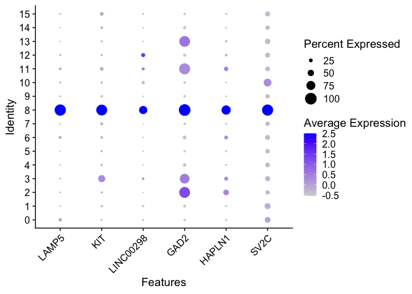

KCNI Summer Academy 2023: Day 2
================
Mel Davie
11/07/2023

# Intro to differential expression, cell type identification & visualizations

## Setup

### Set working directory

``` r
knitr::opts_knit$set(root.dir = "~/Downloads/KCNISS_2023/")
```

### Load packages

``` r
#install.packages("ggpubr")
#install.packages("ggbeeswarm")
library(tidyverse)
```

    ## ── Attaching core tidyverse packages ──────────────────────── tidyverse 2.0.0 ──
    ## ✔ dplyr     1.1.2     ✔ readr     2.1.4
    ## ✔ forcats   1.0.0     ✔ stringr   1.5.0
    ## ✔ ggplot2   3.4.2     ✔ tibble    3.2.1
    ## ✔ lubridate 1.9.2     ✔ tidyr     1.3.0
    ## ✔ purrr     1.0.1     
    ## ── Conflicts ────────────────────────────────────────── tidyverse_conflicts() ──
    ## ✖ dplyr::filter() masks stats::filter()
    ## ✖ dplyr::lag()    masks stats::lag()
    ## ℹ Use the conflicted package (<http://conflicted.r-lib.org/>) to force all conflicts to become errors

``` r
library(Seurat)
```

    ## The legacy packages maptools, rgdal, and rgeos, underpinning the sp package,
    ## which was just loaded, will retire in October 2023.
    ## Please refer to R-spatial evolution reports for details, especially
    ## https://r-spatial.org/r/2023/05/15/evolution4.html.
    ## It may be desirable to make the sf package available;
    ## package maintainers should consider adding sf to Suggests:.
    ## The sp package is now running under evolution status 2
    ##      (status 2 uses the sf package in place of rgdal)
    ## Attaching SeuratObject

``` r
library(ggpubr)
library(ggbeeswarm)
```

### Load Seurat object

``` r
Seu_smart <- readRDS("Seu_smart.rds")
```

## Finding cluster marker genes

### Set your active identity

This changes the grouping variable for your Seurat object for all of the
following analyses. Because we are going to conduct comparisons between
clusters, let’s use the new column that FindClusters() added to our
metadata called “seurat_clusters”.

``` r
Idents(Seu_smart) <- "seurat_clusters" #set active identity to our newly defined clusters
```

### Perform differential expression

*FindMarkers()* identifies genes that are differentially expressed
between one cluster and all other clusters. The parameters ident.1,
logfc.threshold, and min.pct specify the cluster to compare against, the
minimum log-fold change threshold, and the minimum percentage of cells
expressing the gene, respectively. This step helps identify genes that
can potentially distinguish one cluster from other clusters, and can be
used for cell type annotation.

We can use this same function to find genes that can be used to: -
Distinguish one cluster from another closely related cluster -
Distinguish one cluster from all other clusters present

*Note the defaults for this function:* logfc.threshold = 0.25, min.pct =
0.1

*Consider:* can also choose to set a value for min.diff.pct (which is
-Inf by default). This allows you to only test genes with a minimum
difference in the min.pct values between the compared groups.

``` r
# get genes to distinguish cluster 8 from 3
cluster_8_v_3 <- FindMarkers(Seu_smart, ident.1 = 8, ident.2 = 3, 
                             logfc.threshold = log(2), min.pct = 0.5)

# genes to distinguish cluster 8, 2, or 13 from all other clusters
cluster_8_v_all <- FindMarkers(Seu_smart, ident.1 = 8, logfc.threshold = log(2), 
                               min.pct = 0.5)
cluster_2_v_all <- FindMarkers(Seu_smart, ident.1 = 2, logfc.threshold = log(2), 
                               min.pct = 0.5)
cluster_13_v_all <- FindMarkers(Seu_smart, ident.1 = 13, logfc.threshold = log(2), 
                                min.pct = 0.5)
```

*FindAllMarkers()* will find markers that distinguish each cluster from
the others for all clusters at once. If you’re looking to identify cell
types for your clusters, this will be the one you want to run. Note that
it takes a while.

``` r
all_clusters <- FindAllMarkers(Seu_smart, logfc.threshold = log(2), min.pct = 0.50)
```

    ## Calculating cluster 0

    ## Calculating cluster 1

    ## Calculating cluster 2

    ## Calculating cluster 3

    ## Calculating cluster 4

    ## Calculating cluster 5

    ## Calculating cluster 6

    ## Calculating cluster 7

    ## Calculating cluster 8

    ## Calculating cluster 9

    ## Calculating cluster 10

    ## Calculating cluster 11

    ## Calculating cluster 12

    ## Calculating cluster 13

    ## Calculating cluster 14

    ## Calculating cluster 15

### Examine results

``` r
# taking a look at most significantly DE marker genes
cluster_8_v_3 %>% head(n = 10) %>% knitr::kable()
```

|        | p_val | avg_log2FC | pct.1 | pct.2 | p_val_adj |
|:-------|------:|-----------:|------:|------:|----------:|
| LAMP5  |     0 |   7.014312 | 0.966 | 0.052 |         0 |
| NXPH1  |     0 |   5.553789 | 0.993 | 0.405 |         0 |
| MYO16  |     0 |   4.105567 | 1.000 | 0.614 |         0 |
| FGF13  |     0 |   4.753293 | 0.993 | 0.667 |         0 |
| PTPRT  |     0 |   5.431402 | 0.987 | 0.817 |         0 |
| SV2C   |     0 |   5.808065 | 0.953 | 0.379 |         0 |
| PTCHD4 |     0 |   3.764932 | 0.993 | 0.601 |         0 |
| TRPC3  |     0 |   7.518304 | 0.859 | 0.078 |         0 |
| ALK    |     0 |   3.323588 | 0.993 | 0.641 |         0 |
| TOX2   |     0 |   4.654417 | 0.940 | 0.255 |         0 |

``` r
cluster_8_v_all %>% head(n = 10) %>% knitr::kable()
```

|           | p_val | avg_log2FC | pct.1 | pct.2 | p_val_adj |
|:----------|------:|-----------:|------:|------:|----------:|
| LAMP5     |     0 |   6.254035 | 0.966 | 0.081 |         0 |
| KIT       |     0 |   5.639662 | 0.926 | 0.153 |         0 |
| LINC00298 |     0 |   3.526554 | 0.671 | 0.082 |         0 |
| GAD2      |     0 |   3.514560 | 1.000 | 0.352 |         0 |
| HAPLN1    |     0 |   3.984654 | 0.772 | 0.143 |         0 |
| SV2C      |     0 |   5.046462 | 0.953 | 0.389 |         0 |
| EGFR      |     0 |   2.479409 | 0.973 | 0.265 |         0 |
| FGF13     |     0 |   4.344088 | 0.993 | 0.757 |         0 |
| EYA4      |     0 |   4.091275 | 0.879 | 0.283 |         0 |
| NXPH2     |     0 |   3.115083 | 0.893 | 0.242 |         0 |

``` r
cluster_2_v_all %>% head(n = 10) %>% knitr::kable()
```

|              | p_val | avg_log2FC | pct.1 | pct.2 | p_val_adj |
|:-------------|------:|-----------:|------:|------:|----------:|
| TAC1         |     0 |   4.765880 | 0.877 | 0.052 |         0 |
| LHX6         |     0 |   3.053961 | 0.865 | 0.099 |         0 |
| PVALB        |     0 |   5.820159 | 0.703 | 0.073 |         0 |
| C8orf4       |     0 |   3.022580 | 0.677 | 0.088 |         0 |
| LOC101929680 |     0 |   3.315479 | 0.781 | 0.145 |         0 |
| KCNAB3       |     0 |   3.050815 | 0.858 | 0.205 |         0 |
| BTBD11       |     0 |   3.796364 | 0.987 | 0.481 |         0 |
| FBLN7        |     0 |   3.491347 | 0.839 | 0.212 |         0 |
| MYO5B        |     0 |   4.569294 | 0.890 | 0.326 |         0 |
| ERBB4        |     0 |   2.891700 | 1.000 | 0.844 |         0 |

``` r
# two different ways of looking for a specific gene in the output dataframes, 
# where genes are rownames
cluster_2_v_all %>% 
  filter(row.names(.)=="GRIN1")
```

    ##              p_val avg_log2FC pct.1 pct.2    p_val_adj
    ## GRIN1 1.147638e-10  0.6995603 0.865 0.638 5.273396e-06

``` r
cluster_2_v_all %>% 
  rownames_to_column("gene_name") %>% 
  filter(gene_name=="GRIN1")
```

    ##   gene_name        p_val avg_log2FC pct.1 pct.2    p_val_adj
    ## 1     GRIN1 1.147638e-10  0.6995603 0.865 0.638 5.273396e-06

## Using metadata for other comparisons

Now, assume that we’ve performed cell type annotation for all of our
cells using the clusters we’ve defined and their marker genes, and these
are now stored in “subclass_label” in our metadata.

Let’s say we aren’t just interested in comparing between cell types, but
also comparing between cell types derived from male vs. female donors.
Could also think to do something like this for a cell type-specific
case-control comparison.

Let’s focus in on cluster 8, which we would’ve identified as microglia.

``` r
# making new metadata column to see if any sex differences for the same cell type
Seu_smart@meta.data <- Seu_smart@meta.data %>% 
  mutate(sex_subclass = paste(donor_sex_label, subclass_label, sep="_"))

table(Seu_smart$sex_subclass) #see how many cells we have for each sex+subclass combo
```

    ## 
    ##       F_Astrocyte     F_Endothelial              F_IT           F_L4 IT 
    ##                35                25                64                45 
    ##           F_L5 ET    F_L5/6 IT Car3         F_L5/6 NP           F_L6 CT 
    ##                69                66                61                64 
    ##             F_L6b           F_LAMP5       F_Microglia F_Oligodendrocyte 
    ##                73                52                54                42 
    ##             F_OPC            F_PAX6        F_Pericyte           F_PVALB 
    ##                61                59                12                63 
    ##             F_SST             F_VIP            F_VLMC       M_Astrocyte 
    ##                49                62                 5               115 
    ##     M_Endothelial              M_IT           M_L4 IT           M_L5 ET 
    ##                45                86               105                81 
    ##    M_L5/6 IT Car3         M_L5/6 NP           M_L6 CT             M_L6b 
    ##                84                89                86                77 
    ##           M_LAMP5       M_Microglia M_Oligodendrocyte             M_OPC 
    ##                98                96               108                89 
    ##            M_PAX6        M_Pericyte           M_PVALB             M_SST 
    ##                91                20                87               101 
    ##             M_VIP            M_VLMC 
    ##                88                 6

``` r
Idents(Seu_smart) <- "sex_subclass" #setting this new column as our active identity

unique(Idents(Seu_smart)) #seeing what our options are for making comparisons
```

    ##  [1] M_PAX6            M_L5/6 IT Car3    M_OPC             M_VIP            
    ##  [5] M_Astrocyte       M_L5/6 NP         M_SST             M_LAMP5          
    ##  [9] M_Oligodendrocyte M_L5 ET           M_L6b             M_IT             
    ## [13] M_L6 CT           M_Microglia       M_PVALB           M_Pericyte       
    ## [17] M_Endothelial     F_Astrocyte       F_IT              F_L5/6 IT Car3   
    ## [21] F_Microglia       F_SST             F_Oligodendrocyte F_L6b            
    ## [25] F_VIP             F_PAX6            F_OPC             F_LAMP5          
    ## [29] F_L5/6 NP         F_PVALB           F_L6 CT           F_Pericyte       
    ## [33] F_Endothelial     F_VLMC            F_L5 ET           F_L4 IT          
    ## [37] M_VLMC            M_L4 IT          
    ## 38 Levels: M_PAX6 M_L5/6 IT Car3 M_OPC M_VIP M_Astrocyte M_L5/6 NP ... M_L4 IT

``` r
#finding genes that are DE in female-derived microglia vs male-derived
F_microglia_vs_M_microglia <- FindMarkers(Seu_smart, ident.1 = "F_Microglia", 
                                          ident.2 = "M_Microglia", 
                                          logfc.threshold = log(2), min.pct = 0.25)

F_microglia_vs_M_microglia %>% head(n = 10) %>% knitr::kable()
```

|              |    p_val | avg_log2FC | pct.1 | pct.2 | p_val_adj |
|:-------------|---------:|-----------:|------:|------:|----------:|
| LOC105370574 | 0.00e+00 |   5.814892 | 0.556 | 0.167 | 0.0007329 |
| UTY          | 1.00e-07 |  -8.096363 | 0.278 | 0.635 | 0.0025264 |
| LOC105376090 | 1.00e-07 |   4.611635 | 0.444 | 0.094 | 0.0064918 |
| FKBP5        | 3.30e-06 |  -4.185423 | 0.296 | 0.615 | 0.1538988 |
| LOC105370577 | 9.80e-06 |   1.434070 | 0.481 | 0.156 | 0.4507828 |
| FAM118A      | 1.09e-05 |   1.429979 | 0.778 | 0.521 | 0.5004342 |
| HSPA1A       | 1.10e-05 |  -3.902976 | 0.056 | 0.385 | 0.5039668 |
| LOC105378305 | 1.86e-05 |  -2.122296 | 0.685 | 0.812 | 0.8538552 |
| ZBTB16       | 3.19e-05 |  -5.721576 | 0.111 | 0.417 | 1.0000000 |
| SLC1A3       | 4.82e-05 |  -1.511378 | 0.722 | 0.823 | 1.0000000 |

``` r
Seu_smart@assays$RNA@counts["GFAP",][1:10] %>% knitr::kable() #checking if a gene is present in matrix
```

|                     |   x |
|:--------------------|----:|
| F2S4_160113_029_A01 |   0 |
| F2S4_160113_039_C01 |   0 |
| F2S4_160113_040_H01 |  30 |
| F2S4_160113_033_E01 |   0 |
| F2S4_160113_035_D01 |   0 |
| F2S4_160113_047_H01 | 957 |
| F2S4_160113_050_F01 |   0 |
| F2S4_160113_058_C01 |   0 |
| F2S4_160113_060_E01 |   0 |
| F2S4_160113_061_H01 |   0 |

``` r
#this is grabbing the number of reads per sample for the gene GFAP for samples 1-10
```

## Visualizations

We’ll continue with cluster 8 (microglia) to generate a few different
figures with Seurat’s plotting functions.

``` r
#getting top 6 marker genes for distinguishing cluster 8 cells, saving to plot below
features <- cluster_8_v_all %>% 
  head(n=6) %>% 
  row.names

Idents(Seu_smart) <- "seurat_clusters" #setting our active identity back to our clusters
```

### Violin Plot

*VlnPlot()* generates a violin plot to visualize the expression
distribution of the selected marker genes (features) across different
clusters. This plot provides insights into the expression patterns and
variations of these genes within each cluster, including the specific
expression levels and the presence of bimodal or skewed distributions.

``` r
VlnPlot(Seu_smart, features = features)
```

<!-- -->

### Feature Plot

*FeaturePlot()* creates a feature plot to visualize the expression of
the selected marker genes (features) in a scatterplot-like format. This
plot displays the expression levels of the genes on the x-axis and the
fraction of cells expressing the genes on the y-axis, with each dot
representing a cell. It helps visualize the cell-to-cell variation in
gene expression and identify potential correlations or differences
between clusters.

``` r
FeaturePlot(Seu_smart, features = features)
```

<!-- -->

### Dot Plot

*DotPlot()* generates a dot plot to visualize the expression of the
selected marker genes (features) in a matrix-like format. Each row
represents a gene, each column represents a cluster, and the size/color
of the dots indicates the gene expression level. This plot helps
identify genes that are specifically expressed or enriched in cluster 8
compared to other clusters.

``` r
DotPlot(Seu_smart, features = features) + RotatedAxis()
```

<!-- -->

### Heat Map

*DoHeatmap()* creates a heat map to visualize the expression patterns of
the selected marker genes (features) across cells. The heat map
represents the gene expression values as a color-coded matrix, with rows
corresponding to genes and columns corresponding to cells. It provides a
comprehensive view of gene expression similarities and differences
across cells and clusters.

``` r
DoHeatmap(subset(Seu_smart, downsample = 100), features = features, size = 3, 
          slot="data") +
  scale_fill_viridis_c()
```

    ## Scale for fill is already present.
    ## Adding another scale for fill, which will replace the existing scale.

<!-- -->

## Using human 10x data

For more information about this dataset, check this page:
<https://portal.brain-map.org/atlases-and-data/rnaseq/human-mtg-10x_sea-ad>

### Loading data

``` r
# metadata
meta_10x <- read.csv("SEA-AD_10x_meta_mini.csv", row.names = 1)
#row.names(meta_10x) should contain same values as row.names(counts_10x)

# counts matrix
counts_10x <- read.csv("SEA-AD_10x_counts_mini.csv", row.names = 1)

# create Seurat object
Seu_10x <- CreateSeuratObject(counts = t(counts_10x), 
                                meta.data = meta_10x)

#rm(meta_10x, counts_10x)
```

### Pre-processing

#### Quality control (QC)

*Note:* no need with Allen Institute cells, but with other datasets,
should first plot QC metrics (like nfeatures_RNA). If using a histogram,
would see bimodal distribution, can designate one group as “bad
quality”.

**Common QC metrics to check:** - The number of unique genes detected in
each cell. - Low-quality cells or empty droplets will often have very
few genes - Cell doublets or multiplets may exhibit an aberrantly high
gene count - Similarly, the total number of molecules detected within a
cell (correlates strongly with unique genes) - The percentage of reads
that map to the mitochondrial genome - Low-quality / dying cells often
exhibit extensive mitochondrial contamination - We calculate
mitochondrial QC metrics with the PercentageFeatureSet() function, which
calculates the percentage of counts originating from a set of features -
We use the set of all genes starting with MT- as a set of mitochondrial
genes

``` r
# The [[ operator can add columns to object metadata. Can stash QC stats
Seu_10x[["percent.mt"]] <- PercentageFeatureSet(Seu_10x, pattern = "^MT-")

VlnPlot(Seu_10x, features = c("nFeature_RNA", "nCount_RNA", "percent.mt"), ncol = 3)
# looks like mitochondrial genes were filtered out in advance

# FeatureScatter is typically used to visualize feature-feature relationships, can be used
# for anything calculated by the object, e.g. columns in object metadata, PC scores
FeatureScatter(Seu_10x, feature1 = "nCount_RNA", feature2 = "nFeature_RNA")

# If we wanted to use this info to subset our cells, could do so like this
#Seu_10x <- subset(Seu_10x, subset = nFeature_RNA > 200 & nFeature_RNA < 10000 & 
#                    percent.mt < 5)
```

#### Normalization & clustering workflow

``` r
Seu_10x <- Seu_10x %>%
    SCTransform(variable.features.n = 3000) %>%
    RunPCA() %>%
    FindNeighbors(dims = 1:30) %>%
    RunUMAP(dims = 1:30) %>%
    FindClusters()
```

    ## Calculating cell attributes from input UMI matrix: log_umi

    ## Variance stabilizing transformation of count matrix of size 28120 by 3513

    ## Model formula is y ~ log_umi

    ## Get Negative Binomial regression parameters per gene

    ## Using 2000 genes, 3513 cells

    ##   |                                                                              |                                                                      |   0%  |                                                                              |==================                                                    |  25%  |                                                                              |===================================                                   |  50%  |                                                                              |====================================================                  |  75%  |                                                                              |======================================================================| 100%

    ## Found 71 outliers - those will be ignored in fitting/regularization step

    ## Second step: Get residuals using fitted parameters for 28120 genes

    ##   |                                                                              |                                                                      |   0%  |                                                                              |=                                                                     |   2%  |                                                                              |==                                                                    |   4%  |                                                                              |====                                                                  |   5%  |                                                                              |=====                                                                 |   7%  |                                                                              |======                                                                |   9%  |                                                                              |=======                                                               |  11%  |                                                                              |=========                                                             |  12%  |                                                                              |==========                                                            |  14%  |                                                                              |===========                                                           |  16%  |                                                                              |============                                                          |  18%  |                                                                              |==============                                                        |  19%  |                                                                              |===============                                                       |  21%  |                                                                              |================                                                      |  23%  |                                                                              |=================                                                     |  25%  |                                                                              |==================                                                    |  26%  |                                                                              |====================                                                  |  28%  |                                                                              |=====================                                                 |  30%  |                                                                              |======================                                                |  32%  |                                                                              |=======================                                               |  33%  |                                                                              |=========================                                             |  35%  |                                                                              |==========================                                            |  37%  |                                                                              |===========================                                           |  39%  |                                                                              |============================                                          |  40%  |                                                                              |=============================                                         |  42%  |                                                                              |===============================                                       |  44%  |                                                                              |================================                                      |  46%  |                                                                              |=================================                                     |  47%  |                                                                              |==================================                                    |  49%  |                                                                              |====================================                                  |  51%  |                                                                              |=====================================                                 |  53%  |                                                                              |======================================                                |  54%  |                                                                              |=======================================                               |  56%  |                                                                              |=========================================                             |  58%  |                                                                              |==========================================                            |  60%  |                                                                              |===========================================                           |  61%  |                                                                              |============================================                          |  63%  |                                                                              |=============================================                         |  65%  |                                                                              |===============================================                       |  67%  |                                                                              |================================================                      |  68%  |                                                                              |=================================================                     |  70%  |                                                                              |==================================================                    |  72%  |                                                                              |====================================================                  |  74%  |                                                                              |=====================================================                 |  75%  |                                                                              |======================================================                |  77%  |                                                                              |=======================================================               |  79%  |                                                                              |========================================================              |  81%  |                                                                              |==========================================================            |  82%  |                                                                              |===========================================================           |  84%  |                                                                              |============================================================          |  86%  |                                                                              |=============================================================         |  88%  |                                                                              |===============================================================       |  89%  |                                                                              |================================================================      |  91%  |                                                                              |=================================================================     |  93%  |                                                                              |==================================================================    |  95%  |                                                                              |====================================================================  |  96%  |                                                                              |===================================================================== |  98%  |                                                                              |======================================================================| 100%

    ## Computing corrected count matrix for 28120 genes

    ##   |                                                                              |                                                                      |   0%  |                                                                              |=                                                                     |   2%  |                                                                              |==                                                                    |   4%  |                                                                              |====                                                                  |   5%  |                                                                              |=====                                                                 |   7%  |                                                                              |======                                                                |   9%  |                                                                              |=======                                                               |  11%  |                                                                              |=========                                                             |  12%  |                                                                              |==========                                                            |  14%  |                                                                              |===========                                                           |  16%  |                                                                              |============                                                          |  18%  |                                                                              |==============                                                        |  19%  |                                                                              |===============                                                       |  21%  |                                                                              |================                                                      |  23%  |                                                                              |=================                                                     |  25%  |                                                                              |==================                                                    |  26%  |                                                                              |====================                                                  |  28%  |                                                                              |=====================                                                 |  30%  |                                                                              |======================                                                |  32%  |                                                                              |=======================                                               |  33%  |                                                                              |=========================                                             |  35%  |                                                                              |==========================                                            |  37%  |                                                                              |===========================                                           |  39%  |                                                                              |============================                                          |  40%  |                                                                              |=============================                                         |  42%  |                                                                              |===============================                                       |  44%  |                                                                              |================================                                      |  46%  |                                                                              |=================================                                     |  47%  |                                                                              |==================================                                    |  49%  |                                                                              |====================================                                  |  51%  |                                                                              |=====================================                                 |  53%  |                                                                              |======================================                                |  54%  |                                                                              |=======================================                               |  56%  |                                                                              |=========================================                             |  58%  |                                                                              |==========================================                            |  60%  |                                                                              |===========================================                           |  61%  |                                                                              |============================================                          |  63%  |                                                                              |=============================================                         |  65%  |                                                                              |===============================================                       |  67%  |                                                                              |================================================                      |  68%  |                                                                              |=================================================                     |  70%  |                                                                              |==================================================                    |  72%  |                                                                              |====================================================                  |  74%  |                                                                              |=====================================================                 |  75%  |                                                                              |======================================================                |  77%  |                                                                              |=======================================================               |  79%  |                                                                              |========================================================              |  81%  |                                                                              |==========================================================            |  82%  |                                                                              |===========================================================           |  84%  |                                                                              |============================================================          |  86%  |                                                                              |=============================================================         |  88%  |                                                                              |===============================================================       |  89%  |                                                                              |================================================================      |  91%  |                                                                              |=================================================================     |  93%  |                                                                              |==================================================================    |  95%  |                                                                              |====================================================================  |  96%  |                                                                              |===================================================================== |  98%  |                                                                              |======================================================================| 100%

    ## Calculating gene attributes

    ## Wall clock passed: Time difference of 1.147111 mins

    ## Determine variable features

    ## Place corrected count matrix in counts slot

    ## Centering data matrix

    ## Set default assay to SCT

    ## PC_ 1 
    ## Positive:  ZBTB20, NEAT1, SLC1A3, PTGDS, MAML2, QKI, FBXL7, PREX2, ATP1A2, PARD3B 
    ##     DOCK1, NCKAP5, PON2, RFTN2, PTN, ARHGAP24, PTPRZ1, CST3, NHSL1, NPAS3 
    ##     KANK1, DOCK5, NFIA, HIF3A, ERBB4, PARD3, CDH20, GRAMD2B, DAAM2, APOE 
    ## Negative:  KCNIP4, RALYL, AC011287.1, NRG1, ROBO2, IQCJ.SCHIP1, LDB2, CLSTN2, SV2B, AL117329.1 
    ##     TAFA1, CADPS2, PDE1A, AC019211.1, ASIC2, OLFM3, AC013287.1, RYR2, RBFOX1, SLIT3 
    ##     CDH12, NELL2, FSTL4, ADAMTSL1, CPNE4, KIAA1217, ARPP21, RGS6, DPP10, AC090578.1 
    ## PC_ 2 
    ## Positive:  ADARB2, ERBB4, NXPH1, GRIK1, ZNF536, FSTL5, DLX6.AS1, GRIP1, ZNF385D, GAD2 
    ##     CNTN5, FGF13, CXCL14, ALK, MYO16, SGCZ, SLC6A1, SOX2.OT, PRELID2, THSD7A 
    ##     AC132803.1, GAD1, SLC35F4, GALNTL6, PLD5, KCNC2, RBMS3, KIAA1211, DAB1, PTCHD4 
    ## Negative:  AC011287.1, FOXP2, CADPS2, LRMDA, HS3ST4, SV2B, PLXDC2, AL117329.1, PDE1A, ITPR2 
    ##     KCNIP4, TAFA1, MEIS2, AC019211.1, LDB2, SLC1A3, LINC02232, SATB2, MLIP, PTPRK 
    ##     ZFHX3, DOCK4, AC013287.1, DPYD, AC011246.1, CLSTN2, SLC22A10, AC067956.1, SLIT3, GRM3 
    ## PC_ 3 
    ## Positive:  CDH20, PTGDS, PCDH9, NPAS3, PTPRZ1, SLC1A2, GPC5, AL589740.1, NTM, PHLPP1 
    ##     ADGRV1, GPM6A, PPP2R2B, C10orf90, MEIS2, BCAS1, AC079352.1, ATP13A4, KCNH8, CTNNA2 
    ##     RFTN2, HEPN1, FGFR2, OBI1.AS1, NKAIN3, MEGF10, ZFHX4, PDE4B, HEPACAM, KANK1 
    ## Negative:  ST6GAL1, LRMDA, A2M, DOCK8, SLCO2B1, INPP5D, APBB1IP, ST6GALNAC3, FLI1, SRGAP2 
    ##     TBXAS1, SFMBT2, MEF2A, FYB1, ADAM28, TGFBR2, CSF1R, P2RY12, PLXDC2, PALD1 
    ##     CD74, CX3CR1, LNCAROD, MAML3, SYK, SP100, AC008691.1, ATP8B4, DLEU1, LINC01374 
    ## PC_ 4 
    ## Positive:  GPC5, SLC1A2, ADGRV1, OBI1.AS1, ATP1A2, GPM6A, LINC00499, LINC00299, HPSE2, NKAIN3 
    ##     SLC4A4, NHSL1, FGFR3, RANBP3L, COL5A3, RYR3, BMPR1B, PAMR1, ZNF98, PITPNC1 
    ##     RORA, AC002429.2, TPD52L1, HIF3A, ETNPPL, GLI3, SLCO1C1, ATP13A4, ACSBG1, APOE 
    ## Negative:  MBP, PLP1, ST18, CTNNA3, KCNH8, ENPP2, TF, FRMD4B, SLC44A1, PIP4K2A 
    ##     MOG, MOBP, BCAS1, C10orf90, UGT8, RNF220, DOCK10, TMEM144, LINC01608, CERCAM 
    ##     EDIL3, LPAR1, AC012494.1, PDE4B, CNDP1, FOLH1, CLDN11, MAG, IL1RAPL1, TRIM59 
    ## PC_ 5 
    ## Positive:  COBLL1, EBF1, LHFPL6, ITIH5, LAMA2, LEF1, ARHGAP29, UACA, EPAS1, ATP10A 
    ##     THSD4, ANO2, IGFBP7, ADGRF5, AC092957.1, COLEC12, ABCB1, DCN, FLT1, RBMS3 
    ##     PPFIBP1, SYNE2, NKD1, MECOM, ZIC1, CLDN5, ABCG2, LAMA4, PRKCH, LINC02147 
    ## Negative:  ARHGAP24, ITPR2, DOCK4, APBB1IP, DOCK8, PLXDC2, CHST11, SFMBT2, TBXAS1, ADAM28 
    ##     P2RY12, SLC9A9, AC008691.1, FYB1, CX3CR1, CSF1R, LNCAROD, SYNDIG1, SYK, LINC01374 
    ##     AL163541.1, ATP8B4, ARHGAP15, PTPRC, HS3ST4, AOAH, RUNX1, NCKAP5, C3, SORL1

    ## Computing nearest neighbor graph

    ## Computing SNN

    ## Warning: The default method for RunUMAP has changed from calling Python UMAP via reticulate to the R-native UWOT using the cosine metric
    ## To use Python UMAP via reticulate, set umap.method to 'umap-learn' and metric to 'correlation'
    ## This message will be shown once per session

    ## 22:27:46 UMAP embedding parameters a = 0.9922 b = 1.112

    ## 22:27:46 Read 3513 rows and found 30 numeric columns

    ## 22:27:46 Using Annoy for neighbor search, n_neighbors = 30

    ## 22:27:46 Building Annoy index with metric = cosine, n_trees = 50

    ## 0%   10   20   30   40   50   60   70   80   90   100%

    ## [----|----|----|----|----|----|----|----|----|----|

    ## **************************************************|
    ## 22:27:47 Writing NN index file to temp file /var/folders/0l/fg6dr0yd2jv1ffx1qt6vtn6m0000gn/T//Rtmp52Hchz/file1485d65332fc7
    ## 22:27:47 Searching Annoy index using 1 thread, search_k = 3000
    ## 22:27:47 Annoy recall = 100%
    ## 22:27:48 Commencing smooth kNN distance calibration using 1 thread with target n_neighbors = 30
    ## 22:27:48 Found 14 connected components, falling back to 'spca' initialization with init_sdev = 1
    ## 22:27:48 Using 'irlba' for PCA
    ## 22:27:48 PCA: 2 components explained 25.95% variance
    ## 22:27:48 Scaling init to sdev = 1
    ## 22:27:48 Commencing optimization for 500 epochs, with 134942 positive edges
    ## 22:27:54 Optimization finished

    ## Modularity Optimizer version 1.3.0 by Ludo Waltman and Nees Jan van Eck
    ## 
    ## Number of nodes: 3513
    ## Number of edges: 99477
    ## 
    ## Running Louvain algorithm...
    ## Maximum modularity in 10 random starts: 0.9620
    ## Number of communities: 27
    ## Elapsed time: 0 seconds

``` r
ElbowPlot(Seu_10x, ndims = 50)
```

<!-- -->

``` r
p1 <- DimPlot(Seu_10x, reduction = "umap", group.by = "subclass_label", label=TRUE)
p2 <- DimPlot(Seu_10x, reduction = "umap", group.by = "seurat_clusters", label=TRUE)

p1 + p2
```

<!-- -->

### Differential expression

Use Day 1 as a reference to pick some cell types of interest, find their
markers, and visualize them.

#### Plotting marker genes

``` r
all_markers <- FindAllMarkers(Seu_10x, logfc.threshold = log(2), min.pct = .2)
```

    ## Calculating cluster 0

    ## Calculating cluster 1

    ## Calculating cluster 2

    ## Calculating cluster 3

    ## Calculating cluster 4

    ## Calculating cluster 5

    ## Calculating cluster 6

    ## Calculating cluster 7

    ## Calculating cluster 8

    ## Calculating cluster 9

    ## Calculating cluster 10

    ## Calculating cluster 11

    ## Calculating cluster 12

    ## Calculating cluster 13

    ## Calculating cluster 14

    ## Calculating cluster 15

    ## Calculating cluster 16

    ## Calculating cluster 17

    ## Calculating cluster 18

    ## Calculating cluster 19

    ## Calculating cluster 20

    ## Calculating cluster 21

    ## Calculating cluster 22

    ## Calculating cluster 23

    ## Calculating cluster 24

    ## Calculating cluster 25

    ## Calculating cluster 26

``` r
markers <- all_markers %>% 
  distinct(gene, .keep_all = T) %>% 
  group_by(cluster) %>% 
  slice_max(order_by = avg_log2FC, n = 3) %>% 
  pull(gene)

DoHeatmap(subset(Seu_smart, downsample = 100), features = markers, size = 3,
          slot="data") +
  scale_fill_viridis_c()
```

    ## Warning in DoHeatmap(subset(Seu_smart, downsample = 100), features = markers, :
    ## The following features were omitted as they were not found in the data slot for
    ## the RNA assay: CARMN, AC116362.1, AC092957.1, LINC02133, AC006305.1,
    ## AL450352.1, AL356295.1, AC117834.1, LINC02254, AC015943.1, AC016074.2,
    ## MIR3659HG, AC092546.1, AC093843.1, LINC02073, AC022126.1, OBI1.AS1, AC046195.1,
    ## AC046195.2, AC004852.2, AL163541.1, MIR4300HG, AC073091.3, AC060765.2,
    ## AC011287.1, LINC02306

    ## Scale for fill is already present.
    ## Adding another scale for fill, which will replace the existing scale.

<!-- -->

## 10x vs SMART-seq

Now, we’ve looked at two different human-derived single-cell
RNA-sequencing datasets which use two different sequencing
methodologies. Let’s compare them.

Plus, we’ll do a soft intro to ggplots!

### Number of genes detected

``` r
# Store the nFeature_RNA data
features_10x <- Seu_10x$nFeature_RNA %>% data.frame(genes_detected = .,
                                                      method = "10x")
features_smart <- Seu_smart$nFeature_RNA %>% data.frame(genes_detected = .,
                                                      method = "smart")

# Combine the data for plotting
features_combined <- bind_rows(features_10x, features_smart)

# Create a plot to compare the number of detected genes between the two methods
# Box plot
ggplot(features_combined, aes(x = method, y = genes_detected, fill = method)) +
  geom_boxplot() +
  labs(x = "Method", y = "Number of detected genes") +
  ggtitle("Comparison of genes detected per sample between 10x and SMART-seq") +
  theme_classic() +
  stat_compare_means() + 
  theme(legend.position = "none")
```

<!-- -->

``` r
# Violin plot + box plot
ggplot(features_combined, aes(x = method, y = genes_detected, fill = method)) +
  geom_violin() +
  geom_boxplot(width = 0.1, fill = "white", outlier.shape = NA) +
  labs(x = "Method", y = "Number of detected genes") +
  ggtitle("Comparison of genes detected per sample between 10x and SMART-seq") +
  theme_classic() +
  stat_compare_means() + 
  theme(legend.position = "none")
```

<!-- -->

``` r
# Beeswarm plot + box plot
ggplot(features_combined, aes(x = method, y = genes_detected, color = method)) +
  geom_quasirandom(alpha = 0.6, width = 0.2) +
  geom_boxplot(width = 0.1, fill = "white", outlier.shape = NA) +
  labs(x = "Method", y = "Number of detected genes") +
  ggtitle("Comparison of genes detected per sample between 10x and SMART-seq") +
  theme_classic() +
  stat_compare_means() + 
  theme(legend.position = "none")
```

<!-- -->

### Number of RNA molecules

``` r
# Store the nCount_RNA data
RNA_counts_10x <- Seu_10x$nCount_RNA %>% data.frame(RNA_count = .,
                                                      method = "10x")
RNA_counts_smart <- Seu_smart$nCount_RNA %>% data.frame(RNA_count = .,
                                                      method = "smart")

# Combine the data for plotting
RNA_counts_combined <- bind_rows(RNA_counts_10x, RNA_counts_smart)

# Box plot
ggplot(RNA_counts_combined, aes(x = method, y = RNA_count, fill = method)) +
  geom_boxplot() +
  labs(x = "Method", y = "Number of RNA molecules") +
  ggtitle("Comparison of RNA molecules per sample between 10x and SMART-seq") +
  theme_classic() +
  stat_compare_means() + 
  theme(legend.position = "none")
```

<!-- -->

### Another way of doing this:

``` r
features_10x <- Seu_10x@meta.data %>% 
  select(nCount_RNA, nFeature_RNA, subclass_label) %>% 
  mutate(method = "10x")

features_smart <- Seu_smart@meta.data %>% 
  select(nCount_RNA, nFeature_RNA, subclass_label) %>% 
  mutate(method = "smart")

features_combined = bind_rows(features_10x, features_smart)

ggplot(features_combined, aes(x = nCount_RNA, y = nFeature_RNA, colour = subclass_label)) +
  geom_point(alpha = 0.3) + 
  facet_wrap(~method, scales = "free_y") +
  geom_smooth(method = "lm") +
  theme_classic()
```

    ## `geom_smooth()` using formula = 'y ~ x'

<!-- -->

# Save your Seurat object for next time

``` r
saveRDS(Seu_10x, "Seu_10x.rds")
```
