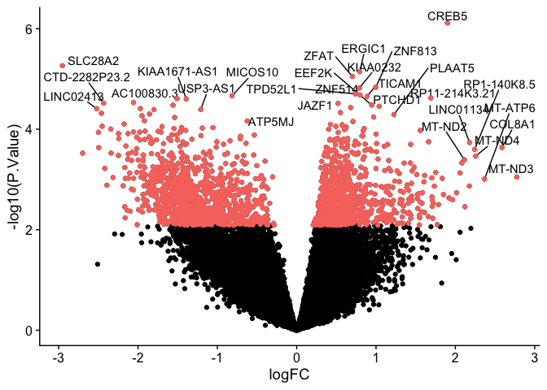

KCNI Summer Academy 2023: Day 4
================
Shreejoy Tripathy and Mel Davie
13/07/2023

# Case-control differential expression with pseudobulks

In this tutorial, we will: *pseudobulk our single-cell data *look at
gene expression between cases and controls (“dementia” vs. “normal”)
*fit a linear model to the data and perform differential gene expression
(DGE) *visualize DGE results \*perform a gene ontology enrichment
analysis

*What are pseudobulks, and why are we using them?* When bulk
RNA-sequencing data is collected, we get many cells representing a
number of different cell types all sequenced together in the same
sample, and we can’t know which cell types are responsible for the gene
expression changes we see between individuals. In single-cell RNA-seq,
we have the benefit of being able to determine the cell type for each
sample, but we also a data structure that reflects a lot of within-cell
type variability that can reduce the signal-to-noise ratio for
between-individual comparisons. Since we’re interested in making
comparisons at the cell type-level between individuals, we “pseudobulk”
our single-cell data to get counts that are similar to what we’d get if
we’d been able to perform bulk RNA-sequencing on just one cell type at a
time in each individual.

## Setup

### Set working directory

``` r
knitr::opts_knit$set(root.dir = "~/Documents/KCNISS_2023/")
```

### Load packages

``` r
# install.packages("BiocManager")
# BiocManager::install("edgeR")
# install.packages("ggrepel")
# install.packages("cowplot")
# install.packages("gprofiler2")

### for older versions of R, may also need to run this:
#BiocManager::install("locfit") 
### if locfit above doesn't work (because your version of R is too old):
#install.packages("https://cran.r-project.org/src/contrib/Archive/locfit/locfit_1.5-9.4.tar.gz", repos=NULL, type="source")

suppressPackageStartupMessages({
  library(tidyverse)
  library(Seurat)
  library(edgeR)
  library(ggrepel)
  library(cowplot)
  library(limma)
  library(ggpubr)
  library(gprofiler2)
})
```

### Pseudobulking of a Seurat count matrix by donors and cell types

We’re going to first illustrate pseudobulking using the 10x SEA-AD
dataset that we used in the prior days.

Note that pseudobulking should be performed on the full dataset, so we
have done this for you and provided the output that will be used for the
remainder of this tutorial. However, to illustrate that process, we will
have you pseudobulk the mini SEA-AD dataset.

#### Create Seurat object

Load in the mini SEA-AD dataset - we can also just load in our older
Seu_10x dataset as well.

``` r
### metadata
meta_10x <- read.csv("./SEA-AD_10x_meta_mini.csv", row.names = 1)
#row.names(meta_10x) should contain same values as row.names(counts_10x)

### counts matrix
counts_10x <- read.csv("./SEA-AD_10x_counts_mini.csv", row.names = 1)

### create Seurat object
Seu_10x <- CreateSeuratObject(counts = t(counts_10x), 
                                meta.data = meta_10x)
```

#### Create the pseudobulk dataset

To do this, we will use a Seurat function called
**AggregateExpression**, which can be used to sum expression values by
some specified identity class.

The metadata columns that we will pseudobulk on are named:
external_donor_name_label, subclass_label. Thus, in our pseudobulked
dataset, columns denote expression from each donor for each cell type.

``` r
### Inspect the metadata to get a sense of what information we could use to pseudobulk
head(meta_10x) %>% knitr::kable()
```

|                                                | sample_name                                    | cluster_color | cluster_order | cluster_label | class_color | class_order | class_label                 | subclass_color | subclass_order | subclass_label | full_genotype_label | donor_sex_label | region_label | cortical_layer_label | cell_type_accession_label | external_donor_name_label |
|:-----------------------------------------------|:-----------------------------------------------|:--------------|--------------:|:--------------|:------------|------------:|:----------------------------|:---------------|---------------:|:---------------|:--------------------|:----------------|:-------------|:---------------------|:--------------------------|:--------------------------|
| AAACCCACAACTCATG-LKTX_191204_01_A01-1156636525 | AAACCCACAACTCATG-LKTX_191204_01_A01-1156636525 | \#D38FEF      |             8 | Pax6_1        | \#F05A28    |           1 | Neuronal: GABAergic         | \#71238C       |              3 | Pax6           | NA                  | M               | MTG          | all                  | CS202204130_8             | H18.30.002                |
| AAACGCTTCGCAAGAG-LKTX_191204_01_A01-1156636525 | AAACGCTTCGCAAGAG-LKTX_191204_01_A01-1156636525 | \#C9C958      |            35 | Sst Chodl_1   | \#F05A28    |           1 | Neuronal: GABAergic         | \#B1B10C       |              6 | Sst Chodl      | NA                  | M               | MTG          | all                  | CS202204130_35            | H18.30.002                |
| AACCAACGTGTATACC-LKTX_191204_01_A01-1156636525 | AACCAACGTGTATACC-LKTX_191204_01_A01-1156636525 | \#5FA3BC      |            93 | L6 CT_2       | \#00ADF8    |           2 | Neuronal: Glutamatergic     | \#2D8CB8       |             16 | L6 CT          | NA                  | M               | MTG          | all                  | CS202204130_93            | H18.30.002                |
| AACCACAAGTACTGTC-LKTX_191204_01_A01-1156636525 | AACCACAAGTACTGTC-LKTX_191204_01_A01-1156636525 | \#979E8A      |           124 | VLMC_1        | \#808080    |           3 | Non-neuronal and Non-neural | \#697255       |             23 | VLMC           | NA                  | M               | MTG          | all                  | CS202204130_124           | H18.30.002                |
| AAGACTCTCTATCCAT-LKTX_191204_01_A01-1156636525 | AAGACTCTCTATCCAT-LKTX_191204_01_A01-1156636525 | \#BE5860      |            53 | Pvalb_6       | \#F05A28    |           1 | Neuronal: GABAergic         | \#D93137       |              8 | Pvalb          | NA                  | M               | MTG          | all                  | CS202204130_53            | H18.30.002                |
| AAGCCATGTTTAGACC-LKTX_191204_01_A01-1156636525 | AAGCCATGTTTAGACC-LKTX_191204_01_A01-1156636525 | \#D8BFB8      |           121 | Endo_1        | \#808080    |           3 | Non-neuronal and Non-neural | \#8D6C62       |             22 | Endothelial    | NA                  | M               | MTG          | all                  | CS202204130_121           | H18.30.002                |

``` r
### We want our counts matrix such that each column is one cell type from one individual
pseudobulk_seu_10x <- AggregateExpression(object = Seu_10x, 
                                          group.by = c('external_donor_name_label', 
                                          'subclass_label'), 
                                          slot = 'counts')

### Extract just the pseudobulked count matrix as a dataframe
pseudobulk_seu_10x_counts <- pseudobulk_seu_10x[['RNA']] %>% as.data.frame()
                 
### Inspect the resulting object - note how the column names are a combination of 
### external_donor_name_label and subclass_label
head(pseudobulk_seu_10x_counts) %>% knitr::kable()
```

|             | H18.30.001_Chandelier | H18.30.001_Endothelial | H18.30.001_L2/3 IT | H18.30.001_L4 IT | H18.30.001_L5 ET | H18.30.001_L5 IT | H18.30.001_L5/6 NP | H18.30.001_L6 CT | H18.30.001_L6 IT | H18.30.001_L6 IT Car3 | H18.30.001_L6b | H18.30.001_Lamp5 | H18.30.001_Lamp5 Lhx6 | H18.30.001_Pax6 | H18.30.001_Pvalb | H18.30.001_Sst | H18.30.001_Sst Chodl | H18.30.001_Vip | H18.30.002_Astrocyte | H18.30.002_Chandelier | H18.30.002_Endothelial | H18.30.002_L2/3 IT | H18.30.002_L4 IT | H18.30.002_L5 ET | H18.30.002_L5 IT | H18.30.002_L5/6 NP | H18.30.002_L6 CT | H18.30.002_L6 IT | H18.30.002_L6 IT Car3 | H18.30.002_L6b | H18.30.002_Lamp5 | H18.30.002_Lamp5 Lhx6 | H18.30.002_Microglia-PVM | H18.30.002_Oligodendrocyte | H18.30.002_OPC | H18.30.002_Pax6 | H18.30.002_Pvalb | H18.30.002_Sncg | H18.30.002_Sst | H18.30.002_Sst Chodl | H18.30.002_Vip | H18.30.002_VLMC | H19.30.001_Astrocyte | H19.30.001_Chandelier | H19.30.001_Endothelial | H19.30.001_L2/3 IT | H19.30.001_L4 IT | H19.30.001_L5 ET | H19.30.001_L5 IT | H19.30.001_L5/6 NP | H19.30.001_L6 CT | H19.30.001_L6 IT | H19.30.001_L6 IT Car3 | H19.30.001_L6b | H19.30.001_Lamp5 | H19.30.001_Lamp5 Lhx6 | H19.30.001_Microglia-PVM | H19.30.001_Oligodendrocyte | H19.30.001_OPC | H19.30.001_Pax6 | H19.30.001_Pvalb | H19.30.001_Sncg | H19.30.001_Sst | H19.30.001_Sst Chodl | H19.30.001_Vip | H19.30.001_VLMC | H19.30.002_Astrocyte | H19.30.002_Chandelier | H19.30.002_Endothelial | H19.30.002_L2/3 IT | H19.30.002_L4 IT | H19.30.002_L5 ET | H19.30.002_L5 IT | H19.30.002_L5/6 NP | H19.30.002_L6 CT | H19.30.002_L6 IT | H19.30.002_L6 IT Car3 | H19.30.002_L6b | H19.30.002_Lamp5 | H19.30.002_Lamp5 Lhx6 | H19.30.002_Microglia-PVM | H19.30.002_Oligodendrocyte | H19.30.002_OPC | H19.30.002_Pax6 | H19.30.002_Pvalb | H19.30.002_Sncg | H19.30.002_Sst | H19.30.002_Sst Chodl | H19.30.002_Vip | H19.30.002_VLMC | H200.1023_Chandelier | H200.1023_Endothelial | H200.1023_L2/3 IT | H200.1023_L4 IT | H200.1023_L5 ET | H200.1023_L5 IT | H200.1023_L5/6 NP | H200.1023_L6 CT | H200.1023_L6 IT | H200.1023_L6 IT Car3 | H200.1023_L6b | H200.1023_Lamp5 | H200.1023_Lamp5 Lhx6 | H200.1023_Pax6 | H200.1023_Pvalb | H200.1023_Sst | H200.1023_Sst Chodl | H200.1023_Vip |
|:------------|----------------------:|-----------------------:|-------------------:|-----------------:|-----------------:|-----------------:|-------------------:|-----------------:|-----------------:|----------------------:|---------------:|-----------------:|----------------------:|----------------:|-----------------:|---------------:|---------------------:|---------------:|---------------------:|----------------------:|-----------------------:|-------------------:|-----------------:|-----------------:|-----------------:|-------------------:|-----------------:|-----------------:|----------------------:|---------------:|-----------------:|----------------------:|-------------------------:|---------------------------:|---------------:|----------------:|-----------------:|----------------:|---------------:|---------------------:|---------------:|----------------:|---------------------:|----------------------:|-----------------------:|-------------------:|-----------------:|-----------------:|-----------------:|-------------------:|-----------------:|-----------------:|----------------------:|---------------:|-----------------:|----------------------:|-------------------------:|---------------------------:|---------------:|----------------:|-----------------:|----------------:|---------------:|---------------------:|---------------:|----------------:|---------------------:|----------------------:|-----------------------:|-------------------:|-----------------:|-----------------:|-----------------:|-------------------:|-----------------:|-----------------:|----------------------:|---------------:|-----------------:|----------------------:|-------------------------:|---------------------------:|---------------:|----------------:|-----------------:|----------------:|---------------:|---------------------:|---------------:|----------------:|---------------------:|----------------------:|------------------:|----------------:|----------------:|----------------:|------------------:|----------------:|----------------:|---------------------:|--------------:|----------------:|---------------------:|---------------:|----------------:|--------------:|--------------------:|--------------:|
| MIR1302.2HG |                     0 |                      0 |                  0 |                0 |                0 |                0 |                  0 |                0 |                0 |                     0 |              0 |                0 |                     0 |               0 |                0 |              0 |                    0 |              0 |                    0 |                     0 |                      0 |                  0 |                0 |                0 |                0 |                  0 |                0 |                0 |                     0 |              0 |                0 |                     0 |                        0 |                          0 |              0 |               0 |                0 |               0 |              0 |                    0 |              0 |               0 |                    0 |                     0 |                      0 |                  0 |                0 |                0 |                0 |                  0 |                0 |                1 |                     0 |              0 |                0 |                     0 |                        0 |                          0 |              0 |               0 |                0 |               0 |              0 |                    0 |              0 |               0 |                    0 |                     0 |                      0 |                  0 |                0 |                0 |                0 |                  0 |                0 |                0 |                     0 |              0 |                0 |                     0 |                        0 |                          0 |              0 |               1 |                0 |               0 |              0 |                    0 |              0 |               0 |                    0 |                     0 |                 0 |               0 |               0 |               0 |                 0 |               0 |               0 |                    0 |             0 |               0 |                    0 |              0 |               0 |             0 |                   0 |             0 |
| AL627309.1  |                     0 |                      0 |                  0 |                1 |                2 |                0 |                  0 |                0 |                0 |                     1 |              1 |                0 |                     0 |               0 |                0 |              0 |                    1 |              0 |                    0 |                     0 |                      0 |                  0 |                0 |                0 |                1 |                  0 |                0 |                0 |                     5 |              0 |                0 |                     0 |                        0 |                          0 |              0 |               0 |                0 |               0 |              1 |                    1 |              2 |               0 |                    0 |                     1 |                      0 |                  2 |                2 |                1 |                3 |                  2 |                2 |                0 |                     0 |              5 |                1 |                     1 |                        5 |                          0 |              0 |               2 |                0 |               1 |              1 |                    0 |              0 |               0 |                    0 |                     0 |                      0 |                  3 |                3 |                1 |                3 |                  0 |                1 |                0 |                     0 |              1 |                0 |                     0 |                        0 |                          0 |              0 |               2 |                0 |               0 |              1 |                    0 |              0 |               0 |                    1 |                     0 |                 1 |               1 |               0 |               1 |                 1 |               3 |               0 |                    2 |             2 |               0 |                    0 |              0 |               0 |             0 |                   0 |             0 |
| AL627309.3  |                     0 |                      0 |                  0 |                0 |                0 |                0 |                  0 |                0 |                0 |                     0 |              0 |                0 |                     0 |               0 |                0 |              0 |                    0 |              0 |                    0 |                     0 |                      0 |                  0 |                0 |                1 |                0 |                  0 |                0 |                0 |                     0 |              0 |                0 |                     0 |                        0 |                          0 |              0 |               0 |                0 |               0 |              0 |                    0 |              0 |               0 |                    0 |                     0 |                      0 |                  0 |                0 |                0 |                0 |                  0 |                0 |                0 |                     0 |              0 |                0 |                     0 |                        0 |                          0 |              0 |               0 |                0 |               0 |              0 |                    0 |              0 |               0 |                    1 |                     1 |                      0 |                  1 |                1 |                1 |                0 |                  0 |                0 |                0 |                     0 |              0 |                0 |                     0 |                        0 |                          0 |              0 |               0 |                1 |               0 |              0 |                    0 |              0 |               0 |                    0 |                     0 |                 0 |               0 |               0 |               0 |                 0 |               0 |               0 |                    0 |             0 |               0 |                    0 |              0 |               0 |             0 |                   0 |             0 |
| AL627309.5  |                     0 |                      0 |                  0 |                1 |                2 |                3 |                  0 |                1 |                0 |                     3 |              3 |                1 |                     1 |               1 |                0 |              0 |                    1 |              0 |                    0 |                     0 |                      0 |                  5 |                1 |                0 |                1 |                  0 |                1 |                5 |                     3 |              2 |                1 |                     3 |                        0 |                          0 |              0 |               0 |                2 |               0 |              0 |                    2 |              1 |               0 |                    2 |                     1 |                      0 |                  7 |                2 |                4 |                3 |                  0 |                4 |                6 |                     3 |              2 |                2 |                     5 |                        2 |                          0 |              0 |               2 |                3 |               4 |              4 |                    2 |              2 |               0 |                    1 |                     1 |                      0 |                  3 |                4 |                6 |                5 |                  3 |                8 |               10 |                     2 |              4 |                1 |                     0 |                        0 |                          2 |              1 |               4 |                0 |               3 |              1 |                    3 |              2 |               1 |                    0 |                     0 |                 0 |               0 |               0 |               1 |                 1 |               2 |               0 |                    4 |             1 |               1 |                    0 |              0 |               0 |             0 |                   0 |             0 |
| AP006222.2  |                     0 |                      0 |                  0 |                0 |                0 |                0 |                  0 |                0 |                0 |                     0 |              0 |                0 |                     0 |               0 |                0 |              0 |                    0 |              0 |                    0 |                     0 |                      0 |                  0 |                0 |                0 |                0 |                  0 |                0 |                0 |                     0 |              0 |                0 |                     0 |                        0 |                          0 |              0 |               0 |                0 |               0 |              0 |                    0 |              0 |               0 |                    0 |                     2 |                      0 |                  0 |                0 |                0 |                0 |                  0 |                0 |                0 |                     0 |              0 |                0 |                     0 |                        0 |                          0 |              0 |               0 |                0 |               0 |              0 |                    0 |              0 |               0 |                    0 |                     0 |                      0 |                  0 |                0 |                0 |                0 |                  0 |                0 |                0 |                     0 |              0 |                0 |                     0 |                        0 |                          0 |              0 |               0 |                0 |               0 |              0 |                    0 |              0 |               0 |                    0 |                     0 |                 0 |               0 |               0 |               0 |                 0 |               0 |               0 |                    0 |             0 |               0 |                    0 |              0 |               0 |             0 |                   0 |             0 |
| AC114498.1  |                     0 |                      0 |                  0 |                0 |                0 |                0 |                  0 |                0 |                0 |                     0 |              0 |                0 |                     0 |               0 |                0 |              0 |                    0 |              0 |                    0 |                     0 |                      0 |                  0 |                0 |                0 |                0 |                  0 |                0 |                0 |                     0 |              0 |                0 |                     0 |                        0 |                          0 |              0 |               0 |                0 |               0 |              0 |                    0 |              0 |               0 |                    0 |                     1 |                      0 |                  0 |                0 |                0 |                0 |                  0 |                0 |                0 |                     0 |              0 |                0 |                     0 |                        0 |                          0 |              0 |               0 |                0 |               0 |              0 |                    0 |              0 |               0 |                    0 |                     0 |                      0 |                  0 |                0 |                0 |                0 |                  0 |                0 |                0 |                     0 |              0 |                0 |                     0 |                        0 |                          0 |              0 |               0 |                0 |               0 |              0 |                    0 |              0 |               0 |                    0 |                     0 |                 0 |               0 |               0 |               0 |                 0 |               0 |               0 |                    0 |             0 |               0 |                    0 |              0 |               0 |             0 |                   0 |             0 |

### Using pre-generated pseudobulks from the full SEA-AD dataset for a specific cell type - Astrocytes

The data we’re about to load in have been pseudobulked in advance using
this script:

<https://github.com/stripathy/pseudobulk_tutorial/blob/master/sea_ad_make_pseudobulk.R>

For our the past couple of days and in our pseudobulking example, we
were working with a smaller version of the SEA-AD 10x dataset that only
included samples from 5 controls. Now, we are working with samples from
all donors, but for the sake of time, we will only examine one cell
type: **astrocytes**.

#### Load pseudobulked gene expression data

We will load in three different files: *the pseudobulked counts matrix
(that we prepared for you), *a dataframe containing gene IDs/symbols,
and \*metadata containing information about each of the 88 donors in our
dataset.

Note that the counts matrix and the gene IDs file have the same number
of rows - order here is important, as each row in the counts matrix
corresponds to a row in the gene IDs file.

**Question:** why not just have the gene IDs as row names for the counts
matrix like you may have done previously - why have two separate files?
You’ll notice that other information about the genes is stored in the
gene_info file, and we want to keep this separate from the counts matrix
(we can’t have both numeric and character vectors in a matrix object).

``` r
pseudobulk_astro_counts <- read_csv('astro_pseudobulk/astro_pseudobulk.csv')
```

    ## Rows: 36517 Columns: 88
    ## ── Column specification ────────────────────────────────────────────────────────
    ## Delimiter: ","
    ## dbl (88): H20.33.013, H21.33.045, H20.33.004, H20.33.018, H21.33.018, H21.33...
    ## 
    ## ℹ Use `spec()` to retrieve the full column specification for this data.
    ## ℹ Specify the column types or set `show_col_types = FALSE` to quiet this message.

``` r
gene_info = read_csv('astro_pseudobulk/astro_pseudobulk_gene_info.csv')
```

    ## Rows: 36517 Columns: 5
    ## ── Column specification ────────────────────────────────────────────────────────
    ## Delimiter: ","
    ## chr (4): gene_symbol, feature_name, feature_reference, feature_biotype
    ## lgl (1): feature_is_filtered
    ## 
    ## ℹ Use `spec()` to retrieve the full column specification for this data.
    ## ℹ Specify the column types or set `show_col_types = FALSE` to quiet this message.

``` r
sea_ad_meta = read_csv('astro_pseudobulk/astro_pseudobulk_meta_updated.csv')
```

    ## Rows: 88 Columns: 105
    ## ── Column specification ────────────────────────────────────────────────────────
    ## Delimiter: ","
    ## chr (84): Donor ID, assay_ontology_term_id, cell_type_ontology_term_id, dise...
    ## dbl (19): Number of UMIs, Genes detected, Fraction mitochrondrial UMIs, Cont...
    ## lgl  (2): is_primary_data, Neurotypical reference
    ## 
    ## ℹ Use `spec()` to retrieve the full column specification for this data.
    ## ℹ Specify the column types or set `show_col_types = FALSE` to quiet this message.

``` r
#rownames(pseudobulk_astro_counts) <- gene_info$gene_symbol
```

#### Preparing for subsequent analyses

Our ultimate goal is to compare gene expression in astrocytes from cases
to that of controls, so we want to set up the case/control variable
(called “disease” in our metadata) such that cases form one group,
controls form another, and our DGE results provide information on cases
relative to controls. Let’s take a look at the current structure of the
*disease* variable and make changes to set up the following analyses.

``` r
### Examine the current structure of the disease variable
str(sea_ad_meta$disease) 
```

    ##  chr [1:88] "normal" "dementia" "dementia" "dementia" "dementia" "normal" ...

``` r
#we have a character vector, which does not acknowledge that any of the values are repeated (no group structure)

### Redefine the disease variable as a factor with 2 levels, where the 2nd level will be considered relative to the first
sea_ad_meta <- sea_ad_meta %>% mutate(disease = factor(disease, 
                                                      levels = c('normal', 'dementia')))

### Examine our new structure
str(sea_ad_meta$disease)
```

    ##  Factor w/ 2 levels "normal","dementia": 1 2 2 2 2 1 1 1 1 2 ...

The full SEA-AD dataset as downloaded also includes previously collected
data from what are referred to as “neurotypical donors,” which could be
used to define cell types. For the purpose of our analyses, we want to
exclude these and look only at the core SEA-AD dataset.

``` r
### Filter out the pseudobulks from neurotypical references
sea_ad_meta <- sea_ad_meta %>% 
  filter(`Neurotypical reference` == F)

### Keep only the counts corresponding to the donors remaining post-filter
pseudobulk_astro_counts <- pseudobulk_astro_counts[sea_ad_meta$donor_id]
```

## Examining our dataset

**Question:** how does the number of astrocytes per person compare
between controls and patients with dementia?

``` r
p1 <- ggplot(sea_ad_meta, aes(x = disease, y = cells_per_donor, fill = disease)) + 
  geom_boxplot() + 
  theme_cowplot() + 
  ylab('Astrocyte nuclei per donor (count)') +
  stat_compare_means() # this adds a p-value from an automatically selected significance test
                       # that compares means (you can change this using the method parameter)

p2 <- ggplot(sea_ad_meta, aes(x = disease, y = cells_per_donor / total_cells_per_donor * 100, 
                              fill = disease)) + 
  geom_boxplot() + 
  theme_cowplot() + 
  ylab('Astrocyte nuclei fraction (%, total nuclei)') +
  stat_compare_means()

p1 + p2
```

<!-- -->

It looks like the total number of astrocytes is similar between
individuals with dementia and controls, but they make up a greater
proportion of all collected cells in individuals with dementia.

**Follow-up question:** What could cause this result?

**Question:** is astrocyte nuclei fraction correlated with our AD
pathology score? (Note that the AD pathology score we are using is
called continuous pseudo-progression score or CPS, check out the SEA-AD
paper for more info on how this was defined:
<https://doi.org/10.1101/2023.05.08.539485>)

``` r
ggplot(sea_ad_meta,
         aes(x = `Continuous Pseudo-progression Score`, y = cells_per_donor / total_cells_per_donor * 100)) + 
  geom_point(aes(color = disease)) + 
  geom_smooth(method = 'lm', se = F, color = "black") + 
  theme_cowplot() + 
  ylab('Astrocyte nuclei fraction (%, total nuclei)') +
  xlab('AD Pathology score') + 
  stat_cor(show.legend = F) 
```

<!-- -->

Following up on our previous result, it looks like the proportion of
astrocytes increases with CPS.

### Normalize our counts to CPM

If we want to plot the expression of a specific gene directly, we should
first perform some normalization to account for technical variation
(like sequencing depth variation) between the samples collected from
each donor. For this, we compute counts per million (CPM).

``` r
### Create a cpm object with normalized gene expression counts for each pseudobulk sample
pseudobulk_astro_cpm <- edgeR::cpm(y = pseudobulk_astro_counts) %>% 
  t() %>% # transpose the matrix so that we have our donors as the rows and genes as the columns
  as.data.frame() # convert the matrix to a data.frame for ggplot

colnames(pseudobulk_astro_cpm) <- gene_info$feature_name # add gene names

pseudobulk_astro_cpm <- left_join(sea_ad_meta, pseudobulk_astro_cpm %>% 
                                       rownames_to_column(var = 'donor_id')) # add on the metadata
```

    ## Joining with `by = join_by(donor_id)`

### Plot gene expression (GFAP below) in case vs. control

Note that we’re plotting log2(count + 1), a common workaround for the
log of zero issue

``` r
ggplot(pseudobulk_astro_cpm, aes(x = disease, y = log2(GFAP+1), fill = disease)) + 
  geom_boxplot() + 
  theme_cowplot() + 
  ylab('GFAP mRNA expr (log2 CPM+1)') +
  stat_compare_means()
```

<!-- -->

It seems that GFAP (a canonical astrocyte marker) is expressed similarly
between controls and individuals with dementia. This makes sense, as you
can recall from our earlier plot that the number of astrocyte nuclei per
donor is also similar between cases and controls.

## Differential expression with limma-voom

Next, we want to systematically determine which genes are differentially
expressed between cases and controls. When doing this, we want to ensure
that we account for any changes in gene expression that are tied to
other variables like sex, post-mortem interval (PMI; a proxy for tissue
quality and, by extension, of RNA quality), age, total RNA quantity
(i.e., library size), and the total number of cells in each pseudobulk.

There are many different tools for performing a differential gene
expression analysis—we will be using a workflow called **limma-voom**.

### Set up statistical model

First, let’s figure out which donors we can use for this analysis. We
need to subset to only include donors for which our metadata contains
information on all of the variables we intend to account for in our
model.

#### Select subjects

This next part gets a bit into Boolean variables or logicals, which are
useful when you want to check if a list of conditions are simultaneously
met.

``` r
### Find subjects with information for disease, Sex, PMI, and Age
use_subjects <- complete.cases(sea_ad_meta %>% 
                                 dplyr::select(disease, Sex, PMI, Age_norm))
# the complete.cases function returns a TRUE/FALSE for each row, so we get a vector with a length matching
# the number of rows in our metadata. TRUE is returned only when a row has no missing values in all selected columns

### the authors say there's a set of 11 subjects with really bad AD that messes up the mRNA in their cells
### and that they should be excluded from downstream analyses
severely_affected_subjects <- c('H20.33.028', 'H20.33.033', 'H20.33.037', 'H20.33.038',
       'H20.33.046', 'H21.33.009', 'H21.33.020', 'H21.33.033',
       'H21.33.034', 'H21.33.039', 'H21.33.045')

### Drop subjects with fewer than 50 astrocytes per donor, younger donors who are part of the neurotypical 
### reference, and subjects who are in the severly_affected_subjects list
use_subjects <- use_subjects & 
  (sea_ad_meta$cells_per_donor > 50) & 
  (!sea_ad_meta$`Cognitive status` == 'Reference') & 
  (!sea_ad_meta$donor_id %in% severely_affected_subjects)
# for the code above, note that every vector provided is the same length, and each is ordered in the same way
# to represent the same rows. Here, we're creating a final vector that will tell us for each row whether all
# specified conditions are met--if any one of them is unmet, the final value for that row will be FALSE

### Filter the metadata to only include donors with information for all desired variables
sea_ad_meta_sub <- sea_ad_meta[use_subjects, ]
```

#### Prepare variables for input to model

We next want to pull out the variables from our metadata that we intend
to include in the model design that we will specify with model.matrix
later on, ensuring that we keep only the values for our selected
subjects.

``` r
disease <- sea_ad_meta_sub %>% 
  pull(disease)
# recall that we previously set this variable as factored so that our results show
# gene expression changes in "disease" relative to "normal"

neuropath_score <- sea_ad_meta_sub %>% 
  pull(`Continuous Pseudo-progression Score`)

sex <- sea_ad_meta_sub %>% 
  pull(Sex)

pmi <- sea_ad_meta_sub %>% 
  pull(PMI)

age <- sea_ad_meta_sub %>% 
  pull(Age_norm)

cells_per_donor <- sea_ad_meta_sub %>% 
  pull(cells_per_donor)

library_size <- pseudobulk_astro_counts[, use_subjects] %>% 
  colSums

### Count the number of subjects for each disease group (are they relatively balanced?)
sea_ad_meta_sub %>% 
  group_by(disease) %>% 
  tally
```

    ## # A tibble: 2 × 2
    ##   disease      n
    ##   <fct>    <int>
    ## 1 normal      41
    ## 2 dementia    32

### Set up DGEList object

In this section, we create an object containing our count matrix and
associated gene info so that we can use this as input for edgeR and
limma functions.

We then apply a gene filter that excludes genes that aren’t detected in
enough of our samples (because we don’t want to analyze differential
expression for any genes that aren’t likely to be biologically
relevant–we’re trying to improve our signal-to-noise ratio).

``` r
### Create DGEList object
dge = DGEList(pseudobulk_astro_counts[, use_subjects], genes = gene_info)

### Filter for genes that are detected in at least 80% of samples
## Step 1: Create a binary matrix indicating if gene is detected in each sample
gene_detection_matrix <- dge$counts >= 1 

## Step 2: Calculate the number of samples in which each gene is detected
gene_detection_counts <- rowSums(gene_detection_matrix)

## Step 3: Define the minimum number of samples required to express the gene
min_samples_expressing_gene <- sea_ad_meta_sub %>% 
  nrow * 0.8 
# The 0.8 here refers to the fraction of total samples that needs to express the gene
# This line just computes the number that represents 80% of the total number of samples

## Step 4: Create a logical vector to identify genes that are detected in enough samples
genes_meeting_threshold <- gene_detection_counts >= min_samples_expressing_gene

## Step 5: Subset the DGEList to retain only genes meeting the threshold
dge <- dge[genes_meeting_threshold, ]

# Note that you could do all of the above in one line like this:
# dge <- dge[rowSums(dge$counts >= 1) >= min_samples_expressing_gene, ]
```

With our filtered DGEList object, we then apply the **calcNormFactors**
function from edgeR. Similar to when we computed counts per million
(CPM), this will provide us with normalized count values that are more
comparable between samples.

We typically compute CPM for the purpose of visualizations, but a
function like calcNormFactors performs additional normalization steps
that improve the reliability and sensitivity of our differential
expression results. In addition to accounting for differences in
sequencing depth like the CPM, it also by default uses a method called
Trimmed Mean of M-values (TMM) that performs the following steps:
-Calculates the M-values for each gene, which represent the log-fold
change in expression between each sample and a reference sample (by
default, the sample whose count-per-million upper quartile is closest to
the mean upper quartile). -Removes a certain percentage of genes with
the highest and lowest M-values. This trimming step helps to mitigate
the influence of genes with extreme expression changes, which could be
due to technical artifacts or biological outliers. -Calculates the mean
M-value of the remaining genes. This trimmed mean serves as a reference
point for the dataset. -Calculates a scaling factor for each sample by
comparing its mean M-value to the trimmed mean M-value. This scaling
factor is used to adjust the expression values for each sample so that
they are more comparable and less affected by technical variability.
-Applies the calculated scaling factors to the gene expression values
for each sample, effectively normalizing the data.

Overall, this method helps to mitigate technical artifacts, biological
outliers, and compositional bias (differences in the relative abundance
of transcripts/genes between samples due to factors like gene length or
GC content).

``` r
### Calculate scaling factors to convert raw counts into "effective counts"
dge <- calcNormFactors(dge, method = "TMM")
```

### Set up design based on the factors defined above

For modeling AD, we have two options: treat it as a binary variable, or
use the continuous AD pathology score that has been provided. Let’s try
both!

#### 1. Binary

``` r
design_bin <- model.matrix(~ age + pmi + sex + log10(cells_per_donor) + log10(library_size) + disease) 

### Perform voom transformation
vm_bin <- voom(dge, design_bin, plot = TRUE)
```

<!-- -->

``` r
### Perform lmFit and eBayes
fit_bin <- lmFit(vm_bin, design_bin)
fit_bin <- eBayes(fit_bin)
```

Note the plot that **voom** outputs. We can see here that there’s a
steady decline in standard deviation (variation) as count size (mean
expression) increases. If you go back and include the genes that
*aren’t* expressed in at least 80% of the samples, you would see a
slightly different relationship, where for low mean expression values,
variance increases with mean expression. This is called
**overdispersion**, and it is essential that we try and correct for this
before running voom to produce more stable variance estimates, thereby
producing more reliable differential expression results.

**lmFit** is performing linear modeling, fitting a linear model to the
voom-transformed data with the specified design matrix, allowing for the
estimation of coefficients (gene expression differences) and their
standard errors for each gene.

**eBayes** is applying empirical Bayes shrinkage to these coefficient
estimates, which stabilizes the variances and provides moderated
t-statistics, improving the reliability of differential expression
analysis results.

#### 2. Continuous

``` r
design_con <- model.matrix(~ age + pmi + sex + log10(cells_per_donor) + log10(library_size) + neuropath_score) 
# neuropath score here is the continuous pseudoprogression score 

### Perform voom transformation
vm_con <- voom(dge, design_con, plot = TRUE)
```

<!-- -->

``` r
### Perform lmFit and eBayes
fit_con <- lmFit(vm_con, design_con)
fit_con <- eBayes(fit_con)
```

### Analyze sex and disease terms

It’s finally time to get our list of differentially expressed genes
(DEGs) and visualize the results!

We will look at DEGs between males and females as well as DEGs between
cases and controls.

#### Analyze genes associated with sex

*Why look at sex—aren’t we just interested in differences between cases
and controls?* It is increasingly required in publications and grant
applications to consider and report the potential influence of sex, as
this has been recognized as a factor that can significantly affect
health outcomes.

To pull the DGE results, we use a function called **topTable**. Here, we
will specify the coefficient we want our log fold changes to reflect
(so, male vs. female), the number of genes we want to pull (Inf will
grab all of them), and the multiple testing correction we want to apply
to our p-values (Benjamini-Hochberg) to manage false positives.

``` r
# What are our coefficients called again?
fit_con$cov.coefficients %>% knitr::kable()
```

|                        | (Intercept) |        age |        pmi |    sexMale | log10(cells_per_donor) | log10(library_size) | neuropath_score |
|:-----------------------|------------:|-----------:|-----------:|-----------:|-----------------------:|--------------------:|----------------:|
| (Intercept)            |  22.5805267 | -0.0433586 | -0.0026290 | -0.1160202 |              3.9810753 |          -4.3524630 |      -0.1462472 |
| age                    |  -0.0433586 |  0.0005426 | -0.0001043 |  0.0005925 |              0.0052911 |          -0.0026566 |       0.0003428 |
| pmi                    |  -0.0026290 | -0.0001043 |  0.0028912 | -0.0009494 |             -0.0096780 |           0.0029783 |      -0.0017025 |
| sexMale                |  -0.1160202 |  0.0005925 | -0.0009494 |  0.0595612 |             -0.0313190 |           0.0185644 |       0.0127731 |
| log10(cells_per_donor) |   3.9810753 |  0.0052911 | -0.0096780 | -0.0313190 |              1.6014498 |          -1.2875509 |      -0.0527505 |
| log10(library_size)    |  -4.3524630 | -0.0026566 |  0.0029783 |  0.0185644 |             -1.2875509 |           1.1901429 |       0.0186944 |
| neuropath_score        |  -0.1462472 |  0.0003428 | -0.0017025 |  0.0127731 |             -0.0527505 |           0.0186944 |       0.2443504 |

``` r
### Binary
deg_table_sex_bin = topTable(fit_bin, coef = "sexMale",  n = Inf, sort = "none", 
                         adjust.method = "BH")

deg_table_sex_bin %>% 
  arrange(adj.P.Val) %>% 
  head() %>% 
  knitr::kable()
```

|       | gene_symbol     | feature_is_filtered | feature_name | feature_reference | feature_biotype |      logFC |   AveExpr |         t | P.Value | adj.P.Val |         B |
|:------|:----------------|:--------------------|:-------------|:------------------|:----------------|-----------:|----------:|----------:|--------:|----------:|----------:|
| 15141 | ENSG00000183878 | FALSE               | UTY          | NCBITaxon:9606    | gene            |   9.293692 | 2.8085932 |  67.59288 |       0 |         0 | 108.77448 |
| 4241  | ENSG00000114374 | FALSE               | USP9Y        | NCBITaxon:9606    | gene            |   8.621163 | 2.4133966 |  63.52956 |       0 |         0 | 106.49799 |
| 20826 | ENSG00000229807 | FALSE               | XIST         | NCBITaxon:9606    | gene            | -10.010775 | 6.0495233 | -62.99493 |       0 |         0 | 107.62225 |
| 13854 | ENSG00000176728 | FALSE               | TTTY14       | NCBITaxon:9606    | gene            |   9.517094 | 2.5853318 |  59.61194 |       0 |         0 | 103.78658 |
| 20633 | ENSG00000229236 | FALSE               | TTTY10       | NCBITaxon:9606    | gene            |   7.489362 | 1.8148080 |  53.62185 |       0 |         0 | 100.83227 |
| 6108  | ENSG00000129824 | FALSE               | RPS4Y1       | NCBITaxon:9606    | gene            |   7.397977 | 0.8659794 |  42.03699 |       0 |         0 |  89.61961 |

``` r
### Continuous
deg_table_sex_con = topTable(fit_con, coef = "sexMale",  n = Inf, sort = "none", 
                         adjust.method = "BH")

deg_table_sex_con %>% 
  arrange(adj.P.Val) %>% 
  head() %>% 
  knitr::kable()
```

|       | gene_symbol     | feature_is_filtered | feature_name | feature_reference | feature_biotype |     logFC |  AveExpr |         t | P.Value | adj.P.Val |         B |
|:------|:----------------|:--------------------|:-------------|:------------------|:----------------|----------:|---------:|----------:|--------:|----------:|----------:|
| 15141 | ENSG00000183878 | FALSE               | UTY          | NCBITaxon:9606    | gene            |  9.301125 | 2.808593 |  67.96988 |       0 |         0 | 108.60748 |
| 4241  | ENSG00000114374 | FALSE               | USP9Y        | NCBITaxon:9606    | gene            |  8.625491 | 2.413397 |  63.45045 |       0 |         0 | 106.12043 |
| 20826 | ENSG00000229807 | FALSE               | XIST         | NCBITaxon:9606    | gene            | -9.995006 | 6.049523 | -61.87708 |       0 |         0 | 106.78141 |
| 13854 | ENSG00000176728 | FALSE               | TTTY14       | NCBITaxon:9606    | gene            |  9.508775 | 2.585332 |  59.61344 |       0 |         0 | 103.51076 |
| 20633 | ENSG00000229236 | FALSE               | TTTY10       | NCBITaxon:9606    | gene            |  7.483908 | 1.814808 |  53.30394 |       0 |         0 | 100.34394 |
| 11403 | ENSG00000165246 | FALSE               | NLGN4Y       | NCBITaxon:9606    | gene            |  7.645141 | 2.960490 |  42.50573 |       0 |         0 |  95.48767 |

Whether we used the binary or the continuous AD measure doesn’t seem to
have much influence here. You can notice that the top DEGs here are
(unsurprisingly) related to the X and Y chromosomes.

#### Volcano plot of genes associated with sex

To get a general sense of the gene expression differences between the
sexes, we can create what is called a **volcano plot** (because it looks
like the mouth of a volcano). It plots -log10(p-value) against log2(fold
change). We transform our p-values for this plot so that the points are
more visible, and higher values now reflect a more significant result.

``` r
deg_table_sex_con %>% 
  ggplot(aes(x = logFC, y = -log10(P.Value), label = feature_name)) + 
  geom_point() +
  geom_text_repel(data = subset(deg_table_sex_con, adj.P.Val < 0.05), 
                  aes(label = feature_name), 
                  vjust = 1.5) +
  geom_point(data = subset(deg_table_sex_con, adj.P.Val < 0.05), 
             aes(color = 'red')) + 
  theme_cowplot() +
  theme(legend.position = "none")
```

    ## Warning: ggrepel: 21 unlabeled data points (too many overlaps). Consider
    ## increasing max.overlaps

<!-- -->

To the right of the volcano (positive logFC), we have genes that are
up-regulated in males relative to females. To the left, we instead have
genes that are up in females.

What separates the genes from the left and right hand sides of the plot?
Does this make sense?

#### Analyze genes associated with disease

Next, let’s pull out the DEGs for our disease variable.

``` r
### Binary
deg_table_disease_bin = topTable(fit_bin, coef = "diseasedementia",  n = Inf, sort = "none", 
                             adjust.method = "BH")

deg_table_disease_bin %>% 
  arrange(adj.P.Val) %>% 
  head(20) %>% 
  knitr::kable()
```

|       | gene_symbol     | feature_is_filtered | feature_name | feature_reference | feature_biotype |      logFC |   AveExpr |         t |   P.Value | adj.P.Val |        B |
|:------|:----------------|:--------------------|:-------------|:------------------|:----------------|-----------:|----------:|----------:|----------:|----------:|---------:|
| 8518  | ENSG00000144810 | FALSE               | COL8A1       | NCBITaxon:9606    | gene            |  1.4508494 | 1.0126172 |  4.854756 | 0.0000069 | 0.0474469 | 3.063379 |
| 11863 | ENSG00000167123 | FALSE               | CERCAM       | NCBITaxon:9606    | gene            |  0.4112622 | 3.4924634 |  4.910404 | 0.0000056 | 0.0474469 | 3.785227 |
| 16939 | ENSG00000198089 | FALSE               | SFI1         | NCBITaxon:9606    | gene            |  0.2847092 | 4.9906213 |  4.826470 | 0.0000077 | 0.0474469 | 3.542490 |
| 23449 | ENSG00000237919 | FALSE               | LRRC7-AS1    | NCBITaxon:9606    | gene            | -1.1373601 | 3.7343019 | -4.806214 | 0.0000083 | 0.0474469 | 3.433539 |
| 2628  | ENSG00000102226 | FALSE               | USP11        | NCBITaxon:9606    | gene            | -0.2786278 | 4.8657344 | -4.670207 | 0.0000138 | 0.0631706 | 3.004389 |
| 34409 | ENSG00000285825 | FALSE               | CCDC15-DT    | NCBITaxon:9606    | gene            | -0.5127951 | 1.9412529 | -4.496325 | 0.0000263 | 0.0999737 | 2.200773 |
| 496   | ENSG00000033122 | FALSE               | LRRC7        | NCBITaxon:9606    | gene            | -0.6037020 | 6.7761441 | -4.305207 | 0.0000525 | 0.1005754 | 1.760382 |
| 628   | ENSG00000047932 | FALSE               | GOPC         | NCBITaxon:9606    | gene            | -0.2900723 | 5.8272531 | -4.317411 | 0.0000503 | 0.1005754 | 1.812366 |
| 2808  | ENSG00000103510 | FALSE               | KAT8         | NCBITaxon:9606    | gene            |  0.2735128 | 4.2369107 |  4.103090 | 0.0001073 | 0.1005754 | 1.145046 |
| 3595  | ENSG00000109084 | FALSE               | TMEM97       | NCBITaxon:9606    | gene            | -0.4640372 | 1.0403367 | -4.172912 | 0.0000840 | 0.1005754 | 1.030313 |
| 6130  | ENSG00000130035 | FALSE               | GALNT8       | NCBITaxon:9606    | gene            |  0.5722273 | 4.2428834 |  4.104382 | 0.0001068 | 0.1005754 | 1.149375 |
| 6448  | ENSG00000132003 | FALSE               | ZSWIM4       | NCBITaxon:9606    | gene            |  0.4468024 | 2.7581153 |  4.073222 | 0.0001190 | 0.1005754 | 1.034028 |
| 7442  | ENSG00000137802 | FALSE               | MAPKBP1      | NCBITaxon:9606    | gene            |  0.2551449 | 5.9391748 |  4.076313 | 0.0001178 | 0.1005754 | 1.026933 |
| 7919  | ENSG00000140743 | FALSE               | CDR2         | NCBITaxon:9606    | gene            |  0.3437148 | 6.5776753 |  4.100893 | 0.0001081 | 0.1005754 | 1.097538 |
| 8207  | ENSG00000143033 | FALSE               | MTF2         | NCBITaxon:9606    | gene            | -0.2717839 | 5.9482661 | -4.087991 | 0.0001131 | 0.1005754 | 1.065122 |
| 11829 | ENSG00000166979 | FALSE               | EVA1C        | NCBITaxon:9606    | gene            |  0.4621062 | 6.4805800 |  4.359518 | 0.0000432 | 0.1005754 | 1.942372 |
| 12550 | ENSG00000170113 | FALSE               | NIPA1        | NCBITaxon:9606    | gene            |  0.2639166 | 4.3460925 |  4.230379 | 0.0000685 | 0.1005754 | 1.548966 |
| 13999 | ENSG00000177469 | FALSE               | CAVIN1       | NCBITaxon:9606    | gene            |  0.7954801 | 1.0125488 |  4.239781 | 0.0000663 | 0.1005754 | 1.205385 |
| 14975 | ENSG00000183186 | FALSE               | C2CD4C       | NCBITaxon:9606    | gene            |  0.7212809 | 0.4784555 |  4.265096 | 0.0000606 | 0.1005754 | 1.186594 |
| 15685 | ENSG00000186364 | FALSE               | NUDT17       | NCBITaxon:9606    | gene            | -0.4126490 | 1.6020692 | -4.428981 | 0.0000336 | 0.1005754 | 1.913939 |

``` r
### Continuous
deg_table_disease_con = topTable(fit_con, coef = "neuropath_score",  n = Inf, sort = "none", 
                             adjust.method = "BH")

deg_table_disease_con %>% 
  arrange(adj.P.Val) %>% 
  head(20) %>% 
  knitr::kable()
```

|       | gene_symbol     | feature_is_filtered | feature_name  | feature_reference | feature_biotype |      logFC |    AveExpr |         t |  P.Value | adj.P.Val |        B |
|:------|:----------------|:--------------------|:--------------|:------------------|:----------------|-----------:|-----------:|----------:|---------:|----------:|---------:|
| 8758  | ENSG00000146592 | FALSE               | CREB5         | NCBITaxon:9606    | gene            |  1.8999022 |  4.8499874 |  5.422711 | 8.00e-07 | 0.0174707 | 5.688366 |
| 981   | ENSG00000066827 | FALSE               | ZFAT          | NCBITaxon:9606    | gene            |  0.7026153 |  4.7720854 |  4.787971 | 8.90e-06 | 0.0386604 | 3.390978 |
| 2780  | ENSG00000103319 | FALSE               | EEF2K         | NCBITaxon:9606    | gene            |  0.9463343 |  7.0164532 |  4.433042 | 3.31e-05 | 0.0386604 | 2.107960 |
| 3944  | ENSG00000111907 | FALSE               | TPD52L1       | NCBITaxon:9606    | gene            |  0.7419727 |  9.8811991 |  4.573588 | 1.98e-05 | 0.0386604 | 2.582066 |
| 4181  | ENSG00000113719 | FALSE               | ERGIC1        | NCBITaxon:9606    | gene            |  0.7947533 |  5.8962679 |  4.845345 | 7.20e-06 | 0.0386604 | 3.566232 |
| 5879  | ENSG00000127666 | FALSE               | TICAM1        | NCBITaxon:9606    | gene            |  0.8875112 |  3.0182726 |  4.542632 | 2.22e-05 | 0.0386604 | 2.569920 |
| 7464  | ENSG00000137860 | FALSE               | SLC28A2       | NCBITaxon:9606    | gene            | -2.9526711 |  1.9466732 | -4.917587 | 5.40e-06 | 0.0386604 | 3.738145 |
| 8406  | ENSG00000144026 | FALSE               | ZNF514        | NCBITaxon:9606    | gene            |  0.7991126 |  4.3695344 |  4.559592 | 2.08e-05 | 0.0386604 | 2.611596 |
| 9565  | ENSG00000153814 | FALSE               | JAZF1         | NCBITaxon:9606    | gene            |  0.5213225 |  6.9585878 |  4.454877 | 3.06e-05 | 0.0386604 | 2.180592 |
| 11388 | ENSG00000165186 | FALSE               | PTCHD1        | NCBITaxon:9606    | gene            |  1.0393228 |  6.9181186 |  4.417138 | 3.50e-05 | 0.0386604 | 2.053950 |
| 12714 | ENSG00000170871 | FALSE               | KIAA0232      | NCBITaxon:9606    | gene            |  0.7899915 |  7.2796574 |  4.646792 | 1.51e-05 | 0.0386604 | 2.842443 |
| 13285 | ENSG00000173436 | FALSE               | MICOS10       | NCBITaxon:9606    | gene            | -0.8136003 |  4.6354334 | -4.549729 | 2.16e-05 | 0.0386604 | 2.562912 |
| 17000 | ENSG00000198346 | FALSE               | ZNF813        | NCBITaxon:9606    | gene            |  0.9971552 |  1.5710321 |  4.656132 | 1.46e-05 | 0.0386604 | 2.809785 |
| 17248 | ENSG00000203280 | FALSE               | KIAA1671-AS1  | NCBITaxon:9606    | gene            | -1.3910477 |  1.0300213 | -4.510734 | 2.49e-05 | 0.0386604 | 2.260959 |
| 17657 | ENSG00000204920 | FALSE               | ZNF155        | NCBITaxon:9606    | gene            |  0.6812048 |  4.8873717 |  4.401663 | 3.71e-05 | 0.0386604 | 2.056985 |
| 27449 | ENSG00000257345 | FALSE               | LINC02413     | NCBITaxon:9606    | gene            | -2.5200323 | -1.2644992 | -4.387078 | 3.91e-05 | 0.0386604 | 1.371734 |
| 27846 | ENSG00000258560 | FALSE               | CTD-2376I20.1 | NCBITaxon:9606    | gene            | -1.7982235 | -0.0437143 | -4.375960 | 4.07e-05 | 0.0386604 | 1.641401 |
| 28190 | ENSG00000259248 | FALSE               | USP3-AS1      | NCBITaxon:9606    | gene            | -1.2095396 |  4.6207362 | -4.376061 | 4.07e-05 | 0.0386604 | 1.974809 |
| 28390 | ENSG00000259635 | FALSE               | AC100830.3    | NCBITaxon:9606    | gene            | -1.5076482 |  2.2059535 | -4.515341 | 2.45e-05 | 0.0386604 | 2.441301 |
| 29342 | ENSG00000261460 | FALSE               | RP11-106M3.3  | NCBITaxon:9606    | gene            | -1.5592151 |  4.0637589 | -4.432587 | 3.31e-05 | 0.0386604 | 2.186575 |

Notice that treating disease as binary versus continuous completely
changes our top genes!

#### Volcano plot of genes associated with disease

``` r
### Binary
deg_table_disease_bin %>% 
  ggplot(aes(x = logFC, y = -log10(P.Value), label = feature_name)) + 
  geom_point() +
  geom_text_repel(data = subset(deg_table_disease_bin, adj.P.Val < 0.1), 
                  aes(label = feature_name), 
                  vjust = 1.5) + 
  geom_point(data = subset(deg_table_disease_bin, adj.P.Val < 0.1), 
             aes(color = 'red')) + 
  theme_cowplot() +
  theme(legend.position = "none")
```

<!-- -->

``` r
### Continuous
deg_table_disease_con %>% 
  ggplot(aes(x = logFC, y = -log10(P.Value), label = feature_name)) + 
  geom_point() +
  geom_text_repel(data = subset(deg_table_disease_con, adj.P.Val < 0.1), 
                  aes(label = feature_name), 
                  vjust = 1.5, max.overlaps = 20) + 
  geom_point(data = subset(deg_table_disease_con, adj.P.Val < 0.1), 
             aes(color = 'red')) + 
  theme_cowplot() +
  theme(legend.position = "none")
```

    ## Warning: ggrepel: 1842 unlabeled data points (too many overlaps). Consider
    ## increasing max.overlaps

<!-- -->

Comparing this volcano plot to our earlier one, we can see there are far
fewer DEGs in our binary AD condition than between the sexes. Why might
this be the case?

Now plotting our continuous AD metric, we can see that there are MANY
more DEGs. Why do you think that is?

#### Plot gene expression of a couple of DE genes below

Let’s now plot some of the DE genes from above to highlight their
expression changes between cases and controls. \##### Binary

``` r
### Binary
col8a1_plot <- ggplot(pseudobulk_astro_cpm[use_subjects, ],
  aes(x = disease, y = log2(COL8A1+1), fill = disease)) + 
  ylab('COL8A1 mRNA expr (log2 CPM+1)') + 
  geom_boxplot() + 
  stat_compare_means() + 
  theme_cowplot() 

lrrc7_plot <- ggplot(pseudobulk_astro_cpm[use_subjects, ],
  aes(x = disease, y = log2(`LRRC7-AS1`+1), fill = disease)) + 
  ylab('LRRC7-AS1 mRNA expr (log2 CPM+1)') + 
  geom_boxplot() + 
  theme_cowplot() +
  stat_compare_means()

col8a1_plot + lrrc7_plot
```

<!-- -->

##### Continuous

``` r
col8a1_plot <- ggplot(pseudobulk_astro_cpm[use_subjects, ],
  aes(x = `Continuous Pseudo-progression Score`, y = log2(COL8A1+1), color = disease, group = 1) ) + 
  ylab('COL8A1 mRNA expr (log2 CPM+1)') + 
  xlab('AD Pathology score') + 
  geom_point() + 
  geom_smooth(color = "black", method = 'lm', se = F) + 
  theme_cowplot() + 
  stat_cor(show.legend = F) 

slc28a2_plot <- ggplot(pseudobulk_astro_cpm[use_subjects, ],
  aes(x = `Continuous Pseudo-progression Score`, y = log2(SLC28A2+1), color = disease, group = 1)) + 
  ylab('SLC28A2 mRNA expr (log2 CPM+1)') + 
  xlab('AD Pathology score') + 
  geom_point() + 
  geom_smooth(color = "black", method = 'lm', se = F) + 
  theme_cowplot() +
  stat_cor(show.legend = F)

col8a1_plot + slc28a2_plot
```

<!-- -->

## Gene ontology analysis

So, we have a few lists of DE genes—now what? One thing you can do after
you know which genes are up- and down-regulated across conditions is to
perform a gene ontology or GO analysis. This will allow you to see if
there are any functions or pathways that are enriched among your list of
genes.

### Sex

#### Get gene lists

Let’s grab the names of the significantly up-regulated and
down-regulated genes from our earlier table. Note that we order these
lists so that the genes that change the most are at the top.

``` r
# Genes that have higher expression in males relative to females
male_up_ordered <- deg_table_sex_con %>% 
  filter(P.Value < 0.05 & logFC > 0) %>% 
  arrange(desc(logFC)) %>% 
  .$gene_symbol

# Genes that have lower expression in males relative to females
male_down_ordered <- deg_table_sex_con %>% 
  filter(P.Value < 0.05 & logFC < 0) %>% 
  arrange(logFC) %>% 
  .$gene_symbol
```

#### Enrichment analysis

We can now supply our ordered gene lists to a function from the package
*gprofiler2* called **gost**. Note that we indicate that our query is
ordered—this will factor into the significance calculations for our
enriched terms.

There are a variety of sources for gene ontology terms you can select.
We’ll grab biological processes (<GO:BP>), cellular components
(<GO:CC>), and molecular functions (<GO:MF>).

We can then grab the most significant terms from each of those sources
within the up- and down-regulated queries separately. This is useful for
selecting terms to highlight in visualizations!

``` r
gp_sex <- gost(list("up-regulated" = male_up_ordered,
      "down-regulated" = male_down_ordered), organism = "hsapiens",
                ordered_query = TRUE, sources = c("GO:BP", "GO:CC", "GO:MF"))

# Top terms
gp_sex_terms <- gp_sex$result %>% 
  group_by(query, source) %>% 
  slice_min(order_by = p_value, n = 2) %>% 
  .$term_id
```

#### Plot results

There are many ways to highlight GO terms. Here’s one that is built in
with *gprofiler2* that can be used to highlight GO terms with high
-log10(p-adj) values.

Don’t focus too much on the code of this plot, this is just a
demonstration of how much you can tweak these figures to improve the
aesthetic.

``` r
gostplot(gp_sex, capped = FALSE, interactive = FALSE, 
         pal = list(`GO:MF` = "#6DC8E8", `GO:CC` = "#FF9179", `GO:BP` = "#57BCAC")) +
  geom_text_repel(mapping = aes(label = ifelse(gp_sex$result$term_id %in% 
                                                 gp_sex_terms,
                                               term_name, "")), 
                  force = 40, max.overlaps = Inf, size = 3) +
  geom_point(size = 3, colour = ifelse(gp_sex$result$term_id %in% 
                                                 gp_sex_terms,
                                       "black", "white"),
             alpha = ifelse(gp_sex$result$term_id %in% 
                                                 gp_sex_terms,
                                       1, 0))
```

<!-- -->

Can you make sense of any of these terms?

### AD Neuropathology - associated genes

#### Get gene lists

``` r
# Genes that have higher expression in individuals with dementia relative to controls
disease_up_ordered <- deg_table_disease_con %>% 
  filter(adj.P.Val < 0.1 & logFC > 0) %>% 
  arrange(desc(logFC)) %>% 
  pull(gene_symbol)

# Genes that have lower expression in individuals with dementia relative to controls
disease_down_ordered <- deg_table_disease_con %>% 
  filter(adj.P.Val < 0.1 & logFC < 0) %>% 
  arrange(logFC) %>% 
  pull(gene_symbol)
```

#### Enrichment analysis

``` r
gp_disease <- gost(list("up-regulated" = disease_up_ordered,
      "down-regulated" = disease_down_ordered), organism = "hsapiens",
                ordered_query = TRUE, sources = c("GO:BP", "GO:CC", "GO:MF"))

# Top terms
gp_disease_terms <- gp_disease$result %>% 
  group_by(query, source) %>% 
  slice_min(order_by = p_value, n = 2) %>% 
  pull(term_id)
```

#### Plot results

``` r
gostplot(gp_disease, capped = FALSE, interactive = FALSE, 
         pal = list(`GO:MF` = "#6DC8E8", `GO:CC` = "#FF9179", `GO:BP` = "#57BCAC")) +
  geom_text_repel(mapping = aes(label = ifelse(gp_disease$result$term_id %in% 
                                                 gp_disease_terms,
                                               term_name, "")), 
                  force = 40, max.overlaps = Inf,size = 3) +
  geom_point(size = 3, colour = ifelse(gp_disease$result$term_id %in% 
                                                 gp_disease_terms,
                                       "black", "white"),
             alpha = ifelse(gp_disease$result$term_id %in% 
                                                 gp_disease_terms,
                                       1, 0))
```

<!-- -->

Finally, do you see any terms that make sense as being affected by AD?
